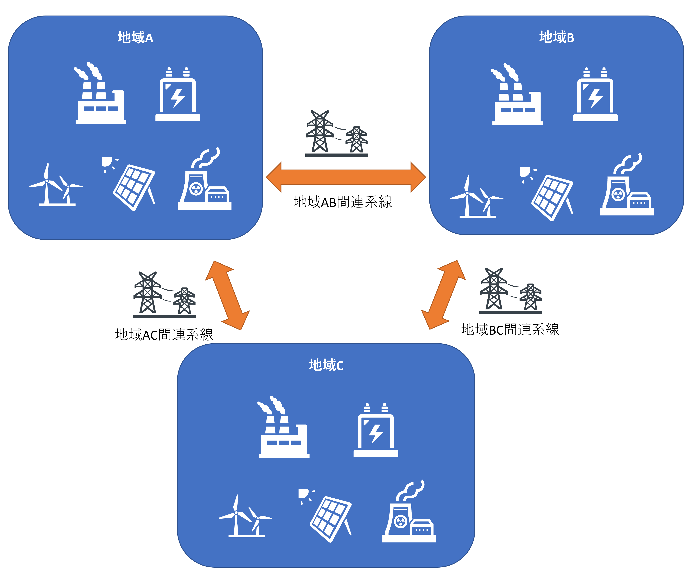
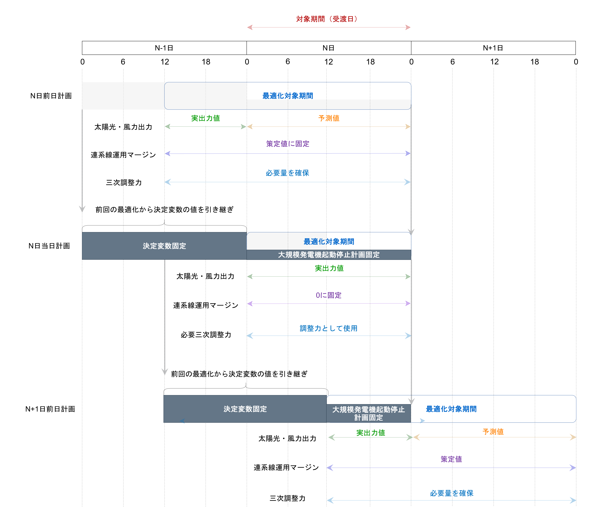

# 特徴

## 発電機起動停止計画（Unit Commitment: UC）としての特徴

- 連系線で接続された複数地域の電力系統を対象として、対象期間（受渡日）のUCが確定するように、前日計画と当日計画を連続で実施する。

  

- 本プログラムのUCは混合整数線形計画法（Mixed-integer linear programming: MILP）で定式化されている。詳細な定式化内容は別ページの[「最適化問題の定式化」](formulation.md)で確認することができる

  - 最適化の目的関数は最適化対象期間の全地域の総コスト最小化である。
  - 決定変数は電力系統の各構成要素の運用計画である。
    - 大規模発電機（火力、原子力、水力）
    - エネルギー貯蔵装置（ESS）
    - 再生可能エネルギー（太陽光、風力）
    - 連系線

  - 主な制約条件は以下の通りである。
    - 電力系統の各構成要素の運用制約
    - 複数地域の需給バランス制約、調整力制約、慣性定数制約

- 前回の最適化で決定された変数の一部を最適化対象前時間帯に引き継ぐことで、連続した最適化（Rolling Optimization）を実現している。

  

## シミュレーションツールとしての特徴

- MILPのソルバーとして、Gurobi Optimizerを用いている。大規模な問題を解くためには有償のライセンスが必要である。
- Gurobi Optimizerの有償ライセンスがない場合でも、MILPをMPSファイル形式で出力することで、他のソルバーツールでの実施が可能となる。
- 最適化対象となる電力系統の各種パラメータはCSVファイル形式で記述され、特定のディレクトリに配置する必要がある。設定ファイルによってインポート対象のデータディレクトリを指定することができる。
- 各回の最適化結果はそれぞれXLSXファイルに保存される。

- 設定によっては、全決定変数の最適化結果をJSONファイル形式で出力することができる。
- 最適化を行う際の条件は、設定ファイルの記載を編集することで、簡単に変更することができる。主な設定項目は別ページの[「設定ファイルの記述方法」](config.md)で確認することができる。

- 本シミュレーションツールは3つのクラスと2つの関数で構成されている。それらのクラスを参照し、編集、組み合わせることで自由度の高いシミュレーションモデルの構築が可能となる。
  - クラス「**UCData**」: 設定ファイルと電力系統モデルを読み込み保存する。
  - クラス「**UCDicts**」: 「UCData」で読み込まれた電力系統モデルを、Gurobiモデルで使用できるように、辞書型に変換し保存する。
  - クラス「**UCVars**」: 最適化の結果を一部保存し、その保存内容を参照して、関数「make_grb_model」で作られたGurobiモデル決定変数の一部を固定する。
  - 関数「**make_grb_model**」: 「UCData」「UCDicts」を元にGurobiモデルを生成する。
  - 関数「**output_result**」: 最適化結果をxlsxファイル等で出力、保存する。
