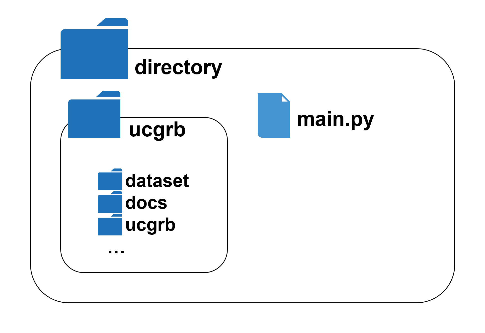
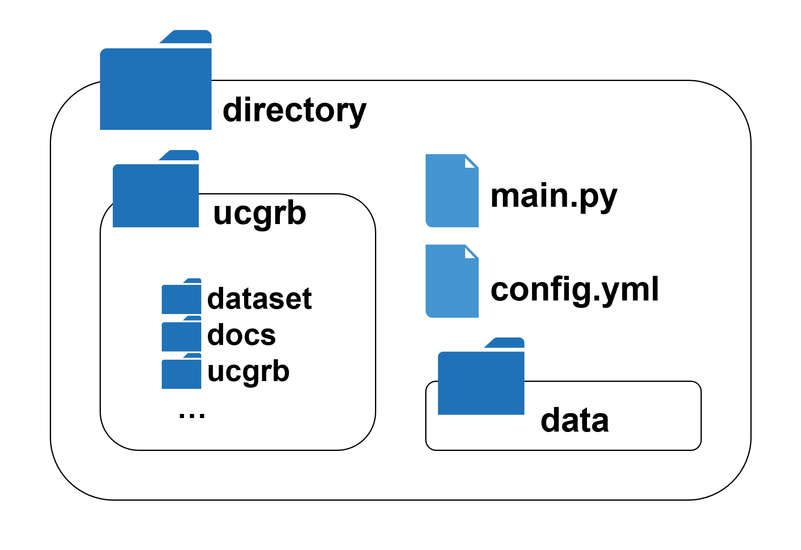
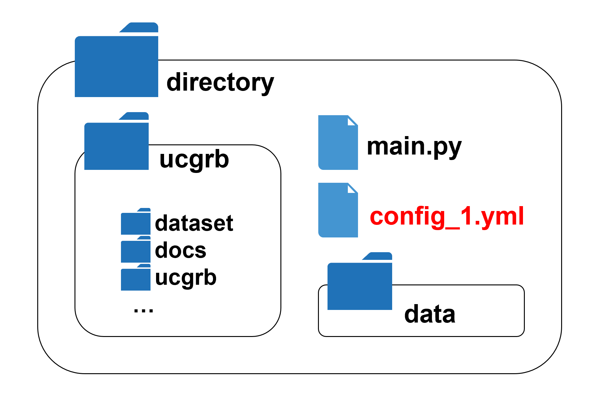
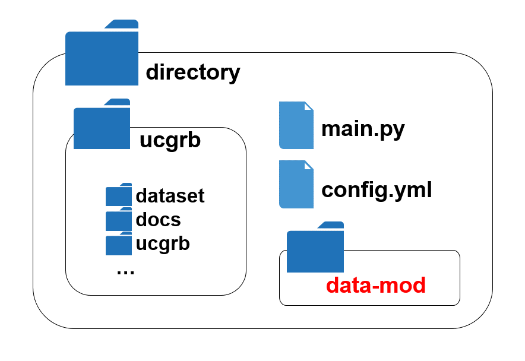

## 実行方法 - Gurobi Optimizer有償版ライセンスがある場合 -

## 1. 動作確認

特に指定をしなければ、以下の条件で最適化を実施する。

- 入力する電力系統データ: 動作確認用の小規模系統データ[「data-example」](../../data_set/data-example)
- 対象期間（受渡日）: 2016年4月1日のみ

具体的な手順は以下の通りである。

1. 本レジストリをクローンする。
     - **注意！** クローンする際、ディレクトリ名を「**ucgrb-private**」ではなく、「**ucgrb**」に変更しなくてはいけない。例えば、コマンドでクローンを行う際には、以下のように記載する必要がある。

       ```cmd
       git clone https://github.com/YamaLabTUS/ucgrb-private.git ucgrb
       ```
       参考URL: [https://git-scm.com/book/ja/v2/Git-の基本-Git-リポジトリの取得](https://git-scm.com/book/ja/v2/Git-%E3%81%AE%E5%9F%BA%E6%9C%AC-Git-%E3%83%AA%E3%83%9D%E3%82%B8%E3%83%88%E3%83%AA%E3%81%AE%E5%8F%96%E5%BE%97)


2. 本レジストリと同一ディレクトリ内に以下のスクリプト「main.py」を作成する。

   ```python:main.py
   from ucgrb.ucgrb import ucgrb

   ucgrb()
   ```

   

3. PowerShell等のコンソールを開いて、本レジストリ内(ucgrb)に移動し、poetryの仮想環境を構築する。

  ```cmd
  cd ucgrb
  poetry install
  ```


4. 仮想環境上で「main.py」を実行する。主に以下の2つの方法がある。

   - poetryの仮想環境シェルに入って、main.pyがある場所にcdコマンドで移動し、`python main.py`を実行する。

     ```cmd
     poetry shell
     cd ../
     python main.py
     ```
  - spyderやVScodeを起動して、インターポレーターをpoetryの仮想環境に指定したのち、「main.py」を開き、実行する。
    


5. 本レポジトリのルートディレクトリの中にディレクトリ「result」が生成され、その中に、実行情報ファイル「info.txt」と結果ファイル（xlsx、json.zip）が出力される

## 2. 設定ファイル、電力系統データの読み込み

独自の設定ファイル「config.yml」、電力系統データ（CSVファイル）がおさめられているディレクトリ「data」を「main.py」、「ucgrb」と同一のディレクトリに配置して、「main.py」を実行する。

例えば、2016年4月1日の前日計画、当日計画、2016年4月2日の前日計画を実施する場合は、config.ymlを以下のように記載する。

```yml
start_date: "2016-04-01"
```

  

## 3. 設定ファイル名の変更

たとえば、設定ファイル名を「config_1.yml」に変更したい場合、「main.py」の記述を以下のように変更すればよい。

```python
from ucgrb.ucgrb import ucgrb

ucgrb("config_1.yml")
```

  

## 4. 電力系統データディレクトリ名の変更

たとえば、電力系統データ（CSVファイル）がおさめられているディレクトリ名を「data-mod」に変更したい場合、「config.yml」を以下のように修正すればよい。

```yml
start_date: "2016-04-01"
csv_data_dir: "data-mod"
```

  