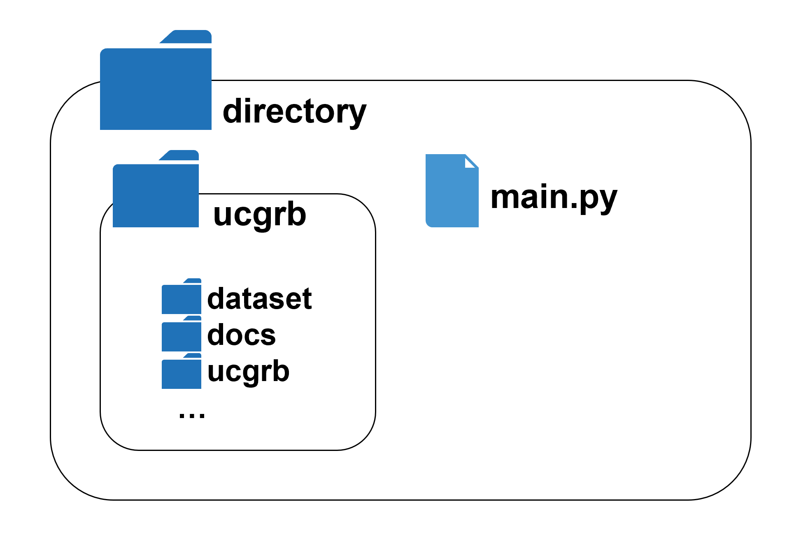
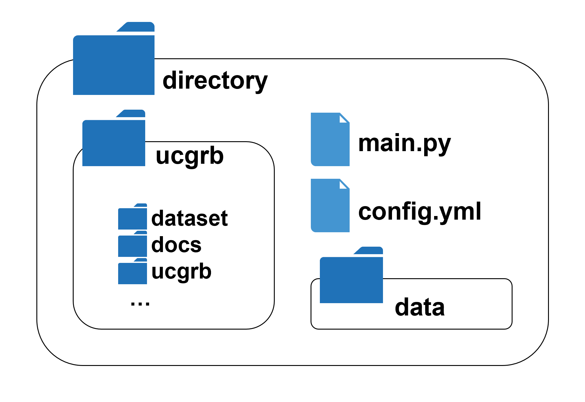
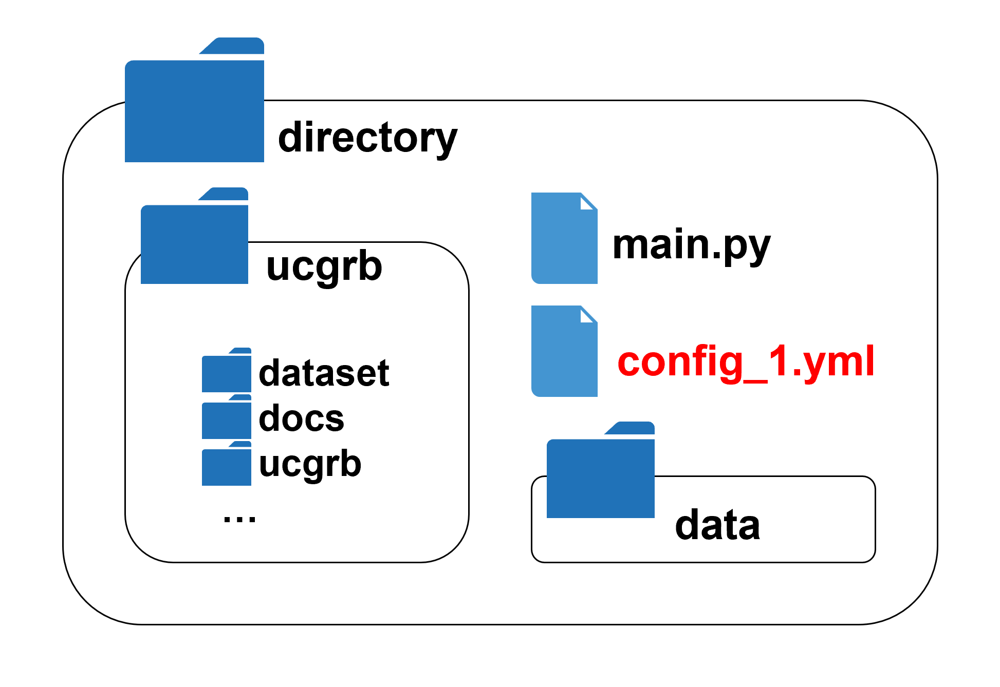
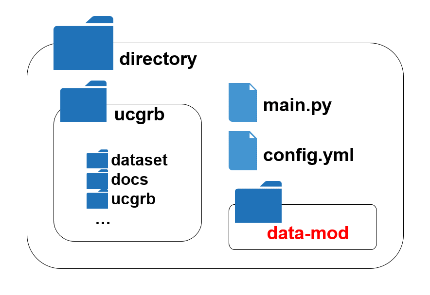

## 実行方法 - Gurobi Optimizer 有償版ライセンスがある場合 -

## 1. 動作確認

特に指定をしなければ、以下の条件で最適化を実施する。

- 入力する電力系統データ: 動作確認用の小規模系統データ[「data-example」](../../data_set/data-example)
- 対象期間（受渡日）: 2016 年 4 月 1 日のみ

具体的な手順は以下の通りである。

1. 本レジストリをクローンする。

     ```cmd
     git clone https://github.com/YamaLabTUS/ucgrb.git
     ```

     参考 URL: [https://git-scm.com/book/ja/v2/Git-の基本-Git-リポジトリの取得](https://git-scm.com/book/ja/v2/Git-%E3%81%AE%E5%9F%BA%E6%9C%AC-Git-%E3%83%AA%E3%83%9D%E3%82%B8%E3%83%88%E3%83%AA%E3%81%AE%E5%8F%96%E5%BE%97)

2. 本レジストリと同一ディレクトリ内に以下のスクリプト「main.py」を作成する。

   ```python:main.py
   from ucgrb.ucgrb import ucgrb

   ucgrb()
   ```

   

3. PowerShell 等のコンソールを開いて、本レジストリ内(ucgrb)に移動し、poetry の仮想環境を構築する。

```cmd
cd ucgrb
poetry install
```

4. 仮想環境上で「main.py」を実行する。主に以下の 2 つの方法がある。

- poetry の仮想環境をアクティベート（有効化）し、main.py がある場所に cd コマンドで移動し、`python main.py`を実行する。PowerShell では以下の入力で実行することができる。

  ```cmd
  $envPath = poetry env info --path
  & "$envPath\Scripts\Activate.ps1"
  cd ../
  python main.py
  ```

- macOS（Terminal）では以下の入力で実行することができる。

  ```bash
  source $(poetry env info --path)/bin/activate
  cd ../
  python main.py
  ```

- spyder や VScode を起動して、インターポレーターを poetry の仮想環境に指定したのち、「main.py」を開き、実行する。

5. 本レポジトリのルートディレクトリの中にディレクトリ「result」が生成され、その中に、実行情報ファイル「info.txt」と結果ファイル（xlsx、json.zip）が出力される

## 2. 設定ファイル、電力系統データの読み込み

独自の設定ファイル「config.yml」、電力系統データ（CSV ファイル）がおさめられているディレクトリ「data」を「main.py」、「ucgrb」と同一のディレクトリに配置して、「main.py」を実行する。

例えば、2016 年 4 月 1 日の前日計画、当日計画、2016 年 4 月 2 日の前日計画を実施する場合は、config.yml を以下のように記載する。

```yml
start_date: "2016-04-01"
```

  

## 3. 設定ファイル名の変更

たとえば、設定ファイル名を「config_1.yml」に変更したい場合、「main.py」の記述を以下のように変更すればよい。

```python
from ucgrb.ucgrb import ucgrb

ucgrb("config_1.yml")
```

  

## 4. 電力系統データディレクトリ名の変更

たとえば、電力系統データ（CSV ファイル）がおさめられているディレクトリ名を「data-mod」に変更したい場合、「config.yml」を以下のように修正すればよい。

```yml
start_date: "2016-04-01"
csv_data_dir: "data-mod"
```

  
