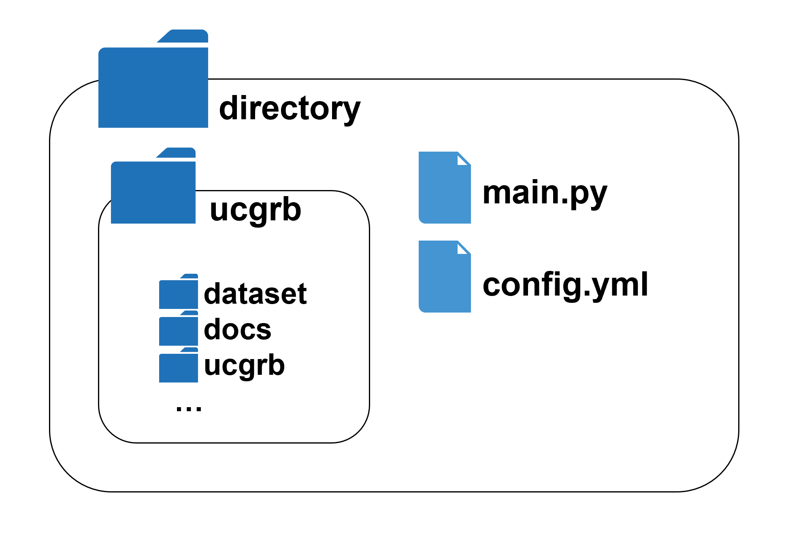

# 実行方法 - Gurobi Optimizer有償版ライセンスがない場合 -

Gurobi Optimizerの有償版ライセンスを保有していない場合、制限版ライセンス（Restricted license）での実施となり、「data-example」では問題規模が大きくなりすぎてしまい、実施することができない。そこで、本ライブラリには制限版ライセンスで実施できる、より小規模な電力系統データ「data-mini」が用意されている。

例として、制限版ライセンスでも実施できる、下記の設定での実施手順を示す。

- 電力系統データ: 限定版ライセンスで実施可能な小規模系統データ[「data-mini」](../../data_set/data-mini)
- 対象期間: 2016年4月1日13:00から21:00までの9時間
- 必要3次調整力制約: 考慮しない
- ESS電力量運用制約: 境界条件（12:00と21:00の蓄電量が50%でなくてはいけない）

具体的な手順は以下の通りである。

1. 本レジストリをクローンする。

2. 本レジストリと同一ディレクトリ内に以下のスクリプト「main.py」と設定ファイル「config.yml」を作成する。

   **main.py**

   ```python
   from ucgrb.ucgrb import ucgrb

   ucgrb()
   ```

   **config.yml**

   ```yaml
   config_name: "Without License Test"
   csv_data_dir: "ucgrb/data_set/data-mini"
   rolling_opt_list:
     - name: "2016-04-01_scheduling"
       start_time: "2016-04-01 13:00:00"
       end_time: "2016-04-01 21:00:00"
       pre_period_hours: 8
       pv_value:
         "2016-04-01 13:00:00": "ACT"
       wf_value:
         "2016-04-01 13:00:00": "ACT"
       fix_tie_margin_to_zero: True
       fix_required_tertiary_reserve_to_zero: True
   make_e_ess_plan_dicts: False
   ```

   

3. 本レポジトリのルートディレクトリにある、Anaconda環境設定ファイル「env.yml」を読み込んで、仮想環境を構築する。

   - 構築方法: [https://www.sandbox-ots.com/2021/12/anaconda-navigatorconda.html](https://www.sandbox-ots.com/2021/12/anaconda-navigatorconda.html)

4. 仮想環境上で「main.py」を実行する。主に以下の2つの方法がある。

   - spyderを起動して、「main.py」を開き、実行する。

   - コンソールを開いて、main.pyがある場所にcdコマンドで移動し、以下のコマンドを実行する。

     ```cmd
     python main.py
     ```

5. 本レポジトリのルートディレクトリの中にディレクトリ「result」が生成され、その中に、実行情報ファイル「info.txt」と結果ファイル（xlsx、json.zip）が出力される
