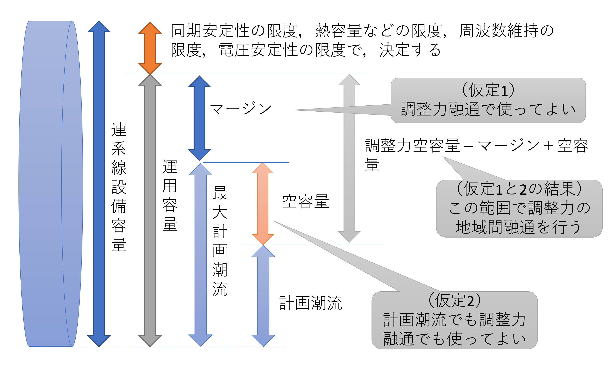
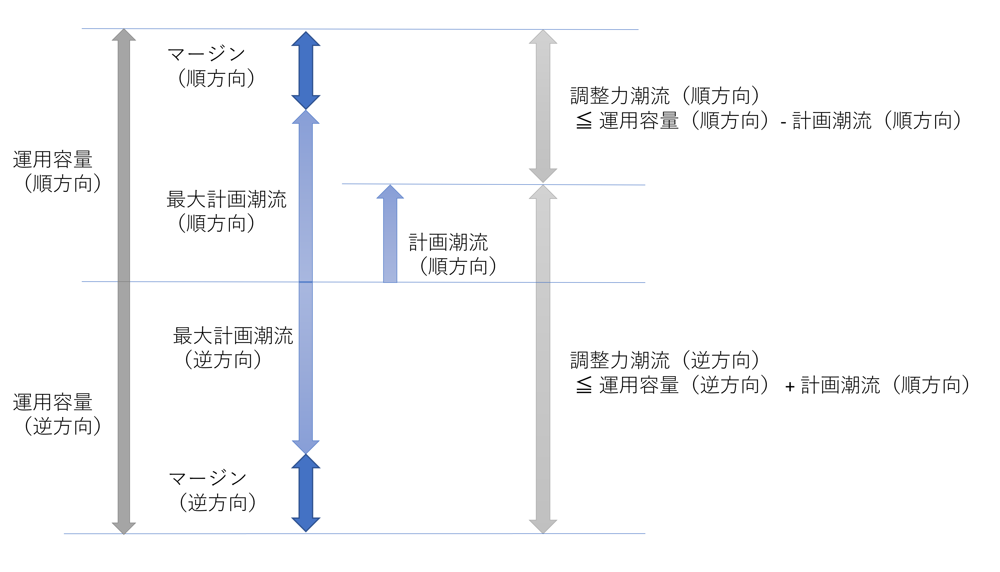
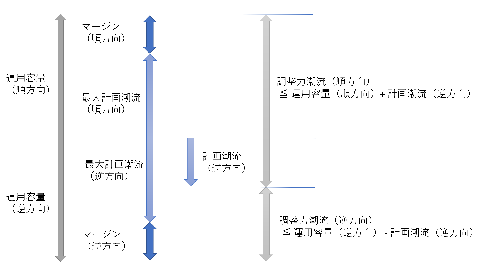

# 連系線に関する制約
各地域を繋ぐ連系線を考慮することができる。

- 繋がれた地域間で電力を融通することができる。送電ロスは考慮できない。代わりに融通した電力量に比例してペナルティが発生し、目的関数（コスト）に加算される。
- GF&LFC調整力や三次調整力も融通することができる。
  - 設定値を変更することで、融通できる調整力に制限を掛ける事ができる。
- 連系線の運用容量とマージンを全期間固定値とするか、月や時間帯で指定するか、最適化時間粒度毎に指定するか選択することができる。デフォルトでは、全期間固定である。
  - デフォルト設定では、当日計画においてマージンを0とすることで、前日計画よりも地域間融通の猶予を与えることができる。

各添字、集合、定数、決定変数の定義は以下のページを参照。
- [添字と集合](../03_set_and_index.md)
- 定数
  1. [地域に関する定数](../04_parameter/01_area.md)
  2. [大規模発電機に関する定数](../04_parameter/02_generator.md)
  3. [再生可能エネルギーに関する定数](../04_parameter/03_re.md)
  4. [エネルギー貯蔵システム（ESS）に関する定数](../04_parameter/04_ess.md)
  5. [連系線に関する定数](../04_parameter/05_tie.md)
  6. [計画種に依存する定数](../04_parameter/06_depend_on_scheduling_kind.md)
- 決定変数
  1. [地域に関する決定変数](../05_variable/01_area.md)
  2. [大規模発電機に関する決定変数](../05_variable/02_geneation.md)
  3. [再生可能エネルギーに関する決定変数](../05_variable/03_re.md)
  4. [エネルギー貯蔵システム（ESS）に関する決定変数](../05_variable/04_ess.md)
  5. [連系線に関する決定変数](../05_variable/05_tie.md)

## 連系線の融通電力量制約

$$
\begin{align}
   p_{t,tie}^{\text{forward}}
    & \leq \left( P_{t,tie}^{\text{TTC, forward}} -
   P_{t,tie}^{\text{Margin, forward}} \right) d_{t,tie}
    & \forall t \in T, \forall tie \in \textit{TIE}
    & \qquad (1)
\\
   p_{t,tie}^{\text{counter}}
    & \leq \left( P_{t,tie}^{\text{TTC, counter}} -
   P_{t,tie}^{\text{Margin, counter}} \right) ( 1- d_{t,tie} )
    & \forall t \in T, \forall tie \in \textit{TIE}
    & \qquad (2)
\end{align}
$$

## 連系線の融通GF&LFC調整力方向制約

$$
\begin{align}
   p_{t,tie}^{\text{GF\\&LFC}\,\text{UP, forward}}
    & \leq \left( P_{t,tie}^{\text{TTC, forward}} +
   P_{t,tie}^{\text{TTC, counter}} \right) d_{t,tie}^{\text{GF\\&LFC}\,\text{UP}}
    & \forall t \in T, \forall tie \in \textit{TIE}
    & \qquad (1)
\\
   p_{t,tie}^{\text{GF\\&LFC}\,\text{UP, counter}}
    & \leq \left( P_{t,tie}^{\text{TTC, forward}} +
   P_{t,tie}^{\text{TTC, counter}} \right) \left( 1 - d_{t,tie}^{\text{GF\\&LFC}\,\text{UP}} \right)
    & \forall t \in T, \forall tie \in \textit{TIE}
    & \qquad (2)
\\
   p_{t,tie}^{\text{GF\\&LFC}\,\text{DOWN, forward}}
    & \leq \left( P_{t,tie}^{\text{TTC, forward}} +
   P_{t,tie}^{\text{TTC, counter}} \right) d_{t,tie}^{\text{GF\\&LFC}\,\text{DOWN}}
    & \forall t \in T, \forall tie \in \textit{TIE}
    & \qquad (3)
\\
   p_{t,tie}^{\text{GF\\&LFC}\,\text{DOWN, counter}}
    & \leq \left( P_{t,tie}^{\text{TTC, forward}} +
   P_{t,tie}^{\text{TTC, counter}} \right) \left( 1 - d_{t,tie}^{\text{GF\\&LFC}\,\text{DOWN}} \right)
    & \forall t \in T, \forall tie \in \textit{TIE}
    & \qquad (4)
\end{align}
$$

## 連系線の融通三次調整力方向制約

$$
\begin{align}
   p_{t,tie}^{\text{Tert}\,\text{UP, forward}}
    & \leq \left( P_{t,tie}^{\text{TTC, forward}} +
   P_{t,tie}^{\text{TTC, counter}} \right) d_{t,tie}^{\text{Tert}\,\text{UP}}
    & \forall t \in T, \forall tie \in \textit{TIE}
    & \qquad (1)
\\
   p_{t,tie}^{\text{Tert}\,\text{UP, counter}}
    & \leq \left( P_{t,tie}^{\text{TTC, forward}} +
   P_{t,tie}^{\text{TTC, counter}} \right) \left( 1 - d_{t,tie}^{\text{Tert}\,\text{UP}} \right)
    & \forall t \in T, \forall tie \in \textit{TIE}
    & \qquad (2)
\\
  p_{t,tie}^{\text{Tert}\,\text{DOWN, forward}}
    & \leq \left( P_{t,tie}^{\text{TTC, forward}} +
   P_{t,tie}^{\text{TTC, counter}} \right) d_{t,tie}^{\text{Tert}\,\text{DOWN}}
    & \forall t \in T, \forall tie \in \textit{TIE}
    & \qquad (3)
\\
   p_{t,tie}^{\text{Tert}\,\text{DOWN, counter}}
    & \leq \left( P_{t,tie}^{\text{TTC, forward}} +
   P_{t,tie}^{\text{TTC, counter}} \right) \left( 1 - d_{t,tie}^{\text{Tert}\,\text{DOWN}} \right)
    & \forall t \in T, \forall tie \in \textit{TIE}
    & \qquad (4)
\end{align}
$$

## 連系線の最大融通調整力制約

$$
\begin{align}
   p_{t,tie}^{\text{GF\\&LFC}\,\text{UP, forward}} + p_{t,tie}^{\text{Tert}\,\text{UP, forward}}
    & \leq P_{t,tie}^{\text{TTC, forward}} - p_{t,tie}^{\text{forward}} + p_{t,tie}^{\text{counter}}
    & \forall t \in T, \forall tie \in \textit{TIE}
    & \qquad (1)
\\
   p_{t,tie}^{\text{GF\\&LFC}\,\text{UP, counter}} + p_{t,tie}^{\text{Tert}\,\text{UP, counter}}
    & \leq P_{t,tie}^{\text{TTC, counter}} - p_{t,tie}^{\text{counter}} + p_{t,tie}^{\text{forward}}
    & \forall t \in T, \forall tie \in \textit{TIE}
    & \qquad (2)
\\
   p_{t,tie}^{\text{GF\\&LFC}\,\text{DOWN, forward}} + p_{t,tie}^{\text{Tert}\,\text{DOWN, forward}}
    & \leq P_{t,tie}^{\text{TTC, counter}} - p_{t,tie}^{\text{counter}} + p_{t,tie}^{\text{forward}}
    & \forall t \in T, \forall tie \in \textit{TIE}
    & \qquad (3)
\\
   p_{t,tie}^{\text{GF\\&LFC}\,\text{DOWN, counter}} + p_{t,tie}^{\text{Tert}\,\text{DOWN, counter}}
    & \leq P_{t,tie}^{\text{TTC, forward}} - p_{t,tie}^{\text{forward}} + p_{t,tie}^{\text{counter}}
    & \forall t \in T, \forall tie \in \textit{TIE}
    & \qquad (4)
\end{align}
$$

$$
\begin{align}
   p_{t,tie}^{\text{GF\\&LFC}\,\text{UP, forward}}
    & \leq P_{t,tie}^{\text{GF\\&LFC}\,\text{UP, forwardMAX}}
    & \forall t \in T, \forall tie \in \textit{TIE}
    & \qquad (5)
\\
   p_{t,tie}^{\text{GF\\&LFC}\,\text{UP, counter}}
    & \leq P_{t,tie}^{\text{GF\\&LFC}\,\text{UP, counterMAX}}
    & \forall t \in T, \forall tie \in \textit{TIE}
    & \qquad (6)
\\
   p_{t,tie}^{\text{GF\\&LFC}\,\text{DOWN, forward}}
    & \leq P_{t,tie}^{\text{GF\\&LFC}\,\text{DOWN, forwardMAX}}
    & \forall t \in T, \forall tie \in \textit{TIE}
    & \qquad (7)
\\
   p_{t,tie}^{\text{GF\\&LFC}\,\text{DOWN, counter}}
    & \leq P_{t,tie}^{\text{GF\\&LFC}\,\text{DOWN, counterMAX}}
    & \forall t \in T, \forall tie \in \textit{TIE}
    & \qquad (8)
\end{align}
$$

$$
\begin{align}
   p_{t,tie}^{\text{Tert}\,\text{UP, forward}}
    & \leq P_{t,tie}^{\text{Tert}\,\text{UP, forwardMAX}}
    & \forall t \in T, \forall tie \in \textit{TIE}
    & \qquad (9)
\\
   p_{t,tie}^{\text{Tert}\,\text{UP, counter}}
    & \leq P_{t,tie}^{\text{Tert}\,\text{UP, counterMAX}}
    & \forall t \in T, \forall tie \in \textit{TIE}
    & \qquad (10)
\\
   p_{t,tie}^{\text{Tert}\,\text{DOWN, forward}}
    & \leq P_{t,tie}^{\text{Tert}\,\text{DOWN, forwardMAX}}
    & \forall t \in T, \forall tie \in \textit{TIE}
    & \qquad (11)
\\
   p_{t,tie}^{\text{Tert}\,\text{DOWN, counter}}
    & \leq P_{t,tie}^{\text{Tert}\,\text{DOWN, counterMAX}}
    & \forall t \in T, \forall tie \in \textit{TIE}
    & \qquad (12)
\end{align}
$$

| 条件名                                     | デフォルト | 設定ファイル上での設定名                     | Falseとしたときの上記式からの変更内容                        |
| :----------------------------------------- | :--------- | :------------------------------------------- | :----------------------------------------------------------- |
| 連系線による電力融通の有無                 | True       | flexible_p_tie                               | 融通電力量 $p_{t,tie}^{\text{forward}}$ , $p_{t,tie}^{\text{counter}}$を0に固定する |
| 連系線によるGF&LFC上向き調整力融通の有無   | True       | flexible_p_tie_gf_lfc_up                     | 融通されるGF&LFC上向き調整力 $p_{t,tie}^{\text{GF\\&LFC}\,\text{UP, forward}}$ , $p_{t,tie}^{\text{GF\\&LFC}\,\text{UP, counter}}$ を0に固定する |
| 連系線によるGF&LFC下向き調整力融通の有無   | False      | flexible_p_tie_gf_lfc_down                   | 融通されるGF&LFC下向き調整力 $p_{t,tie}^{\text{GF\\&LFC}\,\text{DOWN, forward}}$ , $p_{t,tie}^{\text{GF\\&LFC}\,\text{DOWN, counter}}$ を0に固定する |
| 連系線による3次上向き調整力融通の有無      | True       | flexible_p_tie_tert_up                       | 融通される三次上向き調整力 $p_{t,tie}^{\text{Tert}\,\text{UP, forward}}$ , $p_{t,tie}^{\text{Tert}\,\text{UP, counter}}$を0に固定する |
| 連系線による3次下向き調整力融通の有無      | False      | flexible_p_tie_tert_down                     | 融通される三次下向き調整力 $p_{t,tie}^{\text{Tert}\,\text{DOWN, forward}}$ , $p_{t,tie}^{\text{Tert}\,\text{DOWN, counter}}$ を0に固定する |
| 連系線の運用容量制約の考慮                 | True       | consider_TTC                                 | 運用容量 $P_{t,tie}^{\text{TTC, forward}}$ , $P_{t,tie}^{\text{TTC, counter}}$ を100倍にする |
| 連系線の融通調整力最大値制約の考慮         | False      | consider_maximum_ reserve_constraint_for_tie | 連系線の最大融通調整力制約の式（5）から（12）までを考慮しない |
| 当日計画における連系線の運用マージンの考慮 | False      | consider_tie_margin_in_intra-day             | 当日計画のみ、連系線の運用マージン $P_{t,tie}^{\text{Margin, forward}}$ , $P_{t,tie}^{\text{Margin, counter}}$を0にする。 |
