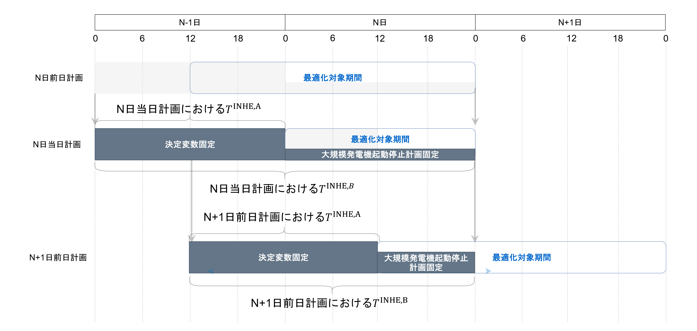

# ローリング最適化における決定変数に関する制約

前回の最適化で決定された変数の一部を最適化対象前時間帯に引き継ぐことで、連続した最適化（Rolling Optimization）を実現している。引き継ぐ変数は以下の通りである。

- 大規模発電機の発電量 $p_{t,g}$
- 原子力・火力の起動停止計画に関する変数 $u_{t,g}$, $su_{t,g}$, $sd_{t,g}$
- エネルギー貯蔵システムの蓄電量 $e_{t,ess}$

- 各変数で引き継ぐ対象期間が異なる
  - 大規模発電機の発電量 $p_{t,g}$とエネルギー貯蔵システムの蓄電量 $e_{t,ess}$の引き継ぎ期間 $T^{\text{INHE,A}}$
    - 開始時間帯: 次の最適化対象期間に前に決定変数が用意される期間の開始時間帯
    - 終了時間帯: 次の最適化対象期間前時間帯
  - 原子力・火力の起動停止計画に関する変数 $u_{t,g}$, $su_{t,g}$, $sd_{t,g}$の引き継ぎ期間 $T^{\text{INHE,B}}$
    - 開始時間帯: 次の最適化対象期間に前に決定変数が用意される期間の開始時間帯
    - 終了時間帯: 今の最適化対象期間最終時間帯
   

各添字、集合、定数、決定変数の定義は以下のページを参照。
- [添字と集合](../03_set_and_index.md)
- 定数
  1. [地域に関する定数](../04_parameter/01_area.md)
  2. [大規模発電機に関する定数](../04_parameter/02_generator.md)
  3. [再生可能エネルギーに関する定数](../04_parameter/03_re.md)
  4. [エネルギー貯蔵システム（ESS）に関する定数](../04_parameter/04_ess.md)
  5. [連系線に関する定数](../04_parameter/05_tie.md)
  6. [計画種に依存する定数](../04_parameter/06_depend_on_scheduling_kind.md)
- 決定変数
  1. [地域に関する決定変数](../05_variable/01_area.md)
  2. [大規模発電機に関する決定変数](../05_variable/02_geneation.md)
  3. [再生可能エネルギーに関する決定変数](../05_variable/03_re.md)
  4. [エネルギー貯蔵システム（ESS）に関する決定変数](../05_variable/04_ess.md)
  5. [連系線に関する決定変数](../05_variable/05_tie.md)

## 前回最適化からの決定変数引き継ぎ

$$
\begin{align}
   p_{t,g}
    & = P_{t,g}^{\text{INHE}}
    & \forall t \in T^{\text{INHE,A}}, \forall g \in G
    & \qquad (1)
\\
   u_{t,g}
    & = U_{t,g}^{\text{INHE}}
    & \forall t \in T^{\text{INHE,B}}, \forall g \in G_{N\\&T}
    & \qquad (2)
\\
   su_{t,g}
    & = SU_{t,g}^{\text{INHE}}
    & \forall t \in T^{\text{INHE,B}}, \forall g \in G_{N\\&T}
    & \qquad (3)
\\
   sd_{t,g}
    & = SD_{t,g}^{\text{INHE}}
    & \forall t \in T^{\text{INHE,B}}, \forall g \in G_{N\\&T}
    & \qquad (4)
\\
   e_{t,ess}
    & = E_{t,ess}^{\text{INHE}}
    & \forall t \in T^{\text{INHE,A}}, \forall ess \in \textit{ESS}
    & \qquad (5)
\end{align}
$$
