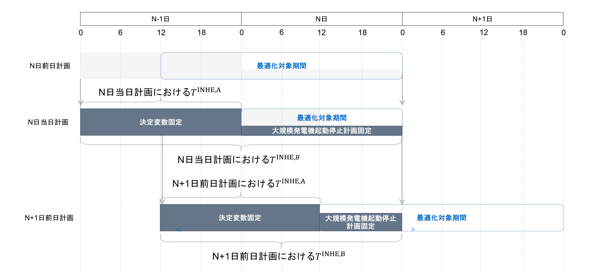

# ローリング最適化における決定変数に関する制約

> **[`formulation_type`](../../06_config/03_unit_commitment.md#formulation_type) による条件分岐**
> 本ページの ΔkW（前日計画）／kWh（当日計画）に関する項目は、ΔkW価値考慮版（`formulation_type: "delta-kW-bid"`）でのみ有効。`delta-kW-no-market`（既定）では三次調整力を単一の予備力量として扱い、これらの項目は無効。

前回の最適化で決定された変数の一部を最適化対象前時間帯に引き継ぐことで、連続した最適化（Rolling Optimization）を実現している。引き継ぐ変数は以下の通りである。

- 大規模発電機の発電量 $p_{t,g}$
- 原子力・火力の起動停止計画に関する変数 $u_{t,g}$, $su_{t,g}$, $sd_{t,g}$
- エネルギー貯蔵システムの蓄電量 $e_{t,ess}$

- 各変数で引き継ぐ対象期間が異なる
  - 大規模発電機の発電量 $p_{t,g}$ とエネルギー貯蔵システムの蓄電量 $e_{t,ess}$ の引き継ぎ期間 $T^{\text{INHE,A}}$
    - 開始時間帯: 次の最適化対象期間に前に決定変数が用意される期間の開始時間帯
    - 終了時間帯: 次の最適化対象期間前時間帯
  - 原子力・火力の起動停止計画に関する変数 $u_{t,g}$, $su_{t,g}$, $sd_{t,g}$ の引き継ぎ期間 $T^{\text{INHE,B}}$
    - 開始時間帯: 次の最適化対象期間に前に決定変数が用意される期間の開始時間帯
    - 終了時間帯: 今の最適化対象期間最終時間帯

各添字、集合、定数、決定変数の定義は以下のページを参照。

- [添字と集合](../03_set_and_index.md)
- 定数
  1. [地域に関する定数](../04_parameter/01_area.md)
  2. [大規模発電機に関する定数](../04_parameter/02_generation.md)
  3. [再生可能エネルギーに関する定数](../04_parameter/03_re.md)
  4. [エネルギー貯蔵システム（ESS）に関する定数](../04_parameter/04_ess.md)
  5. [連系線に関する定数](../04_parameter/05_tie.md)
  6. [計画種に依存する定数](../04_parameter/06_depend_on_scheduling_kind.md)
- 決定変数
  1. [地域に関する決定変数](../05_variable/01_area.md)
  2. [大規模発電機に関する決定変数](../05_variable/02_generation.md)
  3. [再生可能エネルギーに関する決定変数](../05_variable/03_re.md)
  4. [エネルギー貯蔵システム（ESS）に関する決定変数](../05_variable/04_ess.md)
  5. [連系線に関する決定変数](../05_variable/05_tie.md)

## 1. 前回最適化からの決定変数引き継ぎ（両モード共通）

前回の最適化で決定された発電量・起動停止計画・蓄電量の引き継ぎは、`delta-kW-no-market` / `delta-kW-bid` のいずれでも同一に適用される。

$$
\begin{aligned}
   p_{t,g}
    & = P_{t,g}^{\text{INHE}}
    & \forall t \in T^{\text{INHE,A}}, \forall g \in G
    & \qquad (2\text{-}6\text{-}1\text{-}1)
\\
   u_{t,g}
    & = U_{t,g}^{\text{INHE}}
    & \forall t \in T^{\text{INHE,B}}, \forall g \in G_{N\\&T}
    & \qquad (2\text{-}6\text{-}1\text{-}2)
\\
   su_{t,g}
    & = SU_{t,g}^{\text{INHE}}
    & \forall t \in T^{\text{INHE,B}}, \forall g \in G_{N\\&T}
    & \qquad (2\text{-}6\text{-}1\text{-}3)
\\
   sd_{t,g}
    & = SD_{t,g}^{\text{INHE}}
    & \forall t \in T^{\text{INHE,B}}, \forall g \in G_{N\\&T}
    & \qquad (2\text{-}6\text{-}1\text{-}4)
\\
   e_{t,ess}
    & = E_{t,ess}^{\text{INHE}}
    & \forall t \in T^{\text{INHE,A}}, \forall ess \in \textit{ESS}
    & \qquad (2\text{-}6\text{-}1\text{-}5)
\end{aligned}
$$

## 2. 当日計画における前日計画の値の引き継ぎ（`delta-kW-bid` のみ）

本節は ΔkW価値考慮版（`formulation_type: "delta-kW-bid"`）の当日計画（`intra-day`）でのみ使用される。`delta-kW-no-market`（既定）では前日計画／当日計画の区別や ΔkW・kWh・ $P^{\text{da}}$ の機構を持たないため、本節の引き継ぎは適用されない。

当日計画（`intra-day`）を実施する場合、前回の最適化が前日計画（`day-ahead`）であったとき、前日計画で決定された発電量・充放電量の値を当日計画の制約条件で使用するために引き継ぐ。

### 大規模発電機の発電量

前日計画で決定された大規模発電機の発電量 $P_{t,g}^{\text{da}}$ を、当日計画の最適化対象期間 $T$ 全体に対して引き継ぐ。

$$
\begin{aligned}
   P_{t,g}^{\text{da}}
    & = p_{t,g}^{\text{prev}}
    & \forall t \in T, \forall g \in G
\end{aligned}
$$

ここで、 $p_{t,g}^{\text{prev}}$ は前回の前日計画で決定された発電量である。

**注意事項：**

- 前日計画を実施する場合、 $P_{t,g}^{\text{da}}$ は作成されない。
- 当日計画を実施する場合でも、前回の最適化が当日計画であった場合、 $P_{t,g}^{\text{da}}$ は作成されない。
- $P_{t,g}^{\text{da}}$ は最適化対象期間 $T$ 全体に対して作成される（ $T^{\text{INHE,B}} \setminus T^{\text{INHE,A}}$ の期間のみではない）。

### エネルギー貯蔵システムの発電量・充電量

前日計画で決定された ESS の発電量 $P_{t,ess}^{\text{da},\text{discharge}}$ と充電量 $P_{t,ess}^{\text{da},\text{charge}}$ を、当日計画の最適化対象期間 $T$ 全体に対して引き継ぐ。

$$
\begin{aligned}
   P_{t,ess}^{\text{da},\text{discharge}}
    & = p_{t,ess}^{\text{discharge},\text{prev}}
    & \forall t \in T, \forall ess \in ESS
\\
   P_{t,ess}^{\text{da},\text{charge}}
    & = p_{t,ess}^{\text{charge},\text{prev}}
    & \forall t \in T, \forall ess \in ESS
\end{aligned}
$$

ここで、 $p_{t,ess}^{\text{discharge},\text{prev}}$ と $p_{t,ess}^{\text{charge},\text{prev}}$ は前回の前日計画で決定された ESS の発電量・充電量である。

**注意事項：**

- 前日計画を実施する場合、 $P_{t,ess}^{\text{da},\text{discharge}}$ と $P_{t,ess}^{\text{da},\text{charge}}$ は作成されない。
- 当日計画を実施する場合でも、前回の最適化が当日計画であった場合、 $P_{t,ess}^{\text{da},\text{discharge}}$ と $P_{t,ess}^{\text{da},\text{charge}}$ は作成されない。
- $P_{t,ess}^{\text{da},\text{discharge}}$ と $P_{t,ess}^{\text{da},\text{charge}}$ は最適化対象期間 $T$ 全体に対して作成される。

これらの値は、当日計画における発電量・充放電量平均値の制約条件（[大規模発電機に関する制約](../02_constraint/02_generation.md#当日計画における発電量平均値)、[エネルギー貯蔵システム（ESS）に関する制約](../02_constraint/04_ess.md#当日計画における発電量充電量平均値)）で使用される。

### 大規模発電機の三次調整力

前日計画で決定された大規模発電機の三次調整力 $P_{t,g}^{\text{da},\Delta\text{kW}\,\text{Tert}\,\text{UP}}$ と $P_{t,g}^{\text{da},\Delta\text{kW}\,\text{Tert}\,\text{DOWN}}$ を、当日計画の最適化対象期間 $T$ 全体に対して引き継ぐ。

$$
\begin{aligned}
   P_{t,g}^{\text{da},\Delta\text{kW}\,\text{Tert}\,\text{UP}}
    & = p_{t,g}^{\Delta\text{kW}\,\text{Tert}\,\text{UP},\text{prev}}
    & \forall t \in T, \forall g \in G
\\
   P_{t,g}^{\text{da},\Delta\text{kW}\,\text{Tert}\,\text{DOWN}}
    & = p_{t,g}^{\Delta\text{kW}\,\text{Tert}\,\text{DOWN},\text{prev}}
    & \forall t \in T, \forall g \in G
\end{aligned}
$$

ここで、 $p_{t,g}^{\Delta\text{kW}\,\text{Tert}\,\text{UP},\text{prev}}$ と $p_{t,g}^{\Delta\text{kW}\,\text{Tert}\,\text{DOWN},\text{prev}}$ は前回の前日計画で決定された三次調整力である。

**注意事項：**

- 前日計画を実施する場合、 $P_{t,g}^{\text{da},\Delta\text{kW}\,\text{Tert}\,\text{UP}}$ と $P_{t,g}^{\text{da},\Delta\text{kW}\,\text{Tert}\,\text{DOWN}}$ は作成されない。
- 当日計画を実施する場合でも、前回の最適化が当日計画であった場合、 $P_{t,g}^{\text{da},\Delta\text{kW}\,\text{Tert}\,\text{UP}}$ と $P_{t,g}^{\text{da},\Delta\text{kW}\,\text{Tert}\,\text{DOWN}}$ は作成されない。
- $P_{t,g}^{\text{da},\Delta\text{kW}\,\text{Tert}\,\text{UP}}$ と $P_{t,g}^{\text{da},\Delta\text{kW}\,\text{Tert}\,\text{DOWN}}$ は最適化対象期間 $T$ 全体に対して作成される。

### エネルギー貯蔵システムの三次調整力

前日計画で決定された ESS の三次調整力 $P_{t,ess}^{\text{da},\Delta\text{kW}\,\text{Tert}\,\text{UP}}$ と $P_{t,ess}^{\text{da},\Delta\text{kW}\,\text{Tert}\,\text{DOWN}}$ を、当日計画の最適化対象期間 $T$ 全体に対して引き継ぐ。

$$
\begin{aligned}
   P_{t,ess}^{\text{da},\Delta\text{kW}\,\text{Tert}\,\text{UP}}
    & = p_{t,ess}^{\Delta\text{kW}\,\text{Tert}\,\text{UP},\text{prev}}
    & \forall t \in T, \forall ess \in ESS
\\
   P_{t,ess}^{\text{da},\Delta\text{kW}\,\text{Tert}\,\text{DOWN}}
    & = p_{t,ess}^{\Delta\text{kW}\,\text{Tert}\,\text{DOWN},\text{prev}}
    & \forall t \in T, \forall ess \in ESS
\end{aligned}
$$

ここで、 $p_{t,ess}^{\Delta\text{kW}\,\text{Tert}\,\text{UP},\text{prev}}$ と $p_{t,ess}^{\Delta\text{kW}\,\text{Tert}\,\text{DOWN},\text{prev}}$ は前回の前日計画で決定された ESS の三次調整力である。

**注意事項：**

- 前日計画を実施する場合、 $P_{t,ess}^{\text{da},\Delta\text{kW}\,\text{Tert}\,\text{UP}}$ と $P_{t,ess}^{\text{da},\Delta\text{kW}\,\text{Tert}\,\text{DOWN}}$ は作成されない。
- 当日計画を実施する場合でも、前回の最適化が当日計画であった場合、 $P_{t,ess}^{\text{da},\Delta\text{kW}\,\text{Tert}\,\text{UP}}$ と $P_{t,ess}^{\text{da},\Delta\text{kW}\,\text{Tert}\,\text{DOWN}}$ は作成されない。
- $P_{t,ess}^{\text{da},\Delta\text{kW}\,\text{Tert}\,\text{UP}}$ と $P_{t,ess}^{\text{da},\Delta\text{kW}\,\text{Tert}\,\text{DOWN}}$ は最適化対象期間 $T$ 全体に対して作成される。

これらの値は、当日計画における三次調整力の制約条件で使用される。
