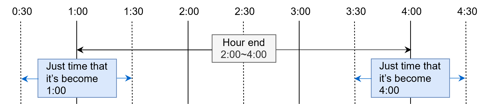

# 発電機データ

> **注**: 本ページの ΔkW／kWh／p^id 等の項目は ΔkW価値考慮版（`formulation_type: "delta-kW-bid"`）でのみ使用される。`delta-kW-no-market`（既定）では参照されない。

## 発電機

**ファイル名: generation.csv**

- 各発電機の特徴を記載
- 水力発電機とそれ以外で必要データが異なるため、表で分けて表示
- 表の **`delta-kW-bid で使用`** 列は、その項目が ΔkW価値考慮版（`formulation_type: "delta-kW-bid"`）専用か（`✓（専用）`）、両モード共通か（`共通`）を示す。`✓（専用）` の列は `delta-kW-no-market`（既定）では読み込まれず、`delta-kW-bid` 指定時に列が無ければ各行の「概要」に記載の既定値で補完される（例: `C_fuel_kWh_UP` は `C_fuel`、`C_fuel_kWh_DOWN` は `-1 × C_fuel`、その他の ΔkW/kWh 列は `0`）。

| インデックス                                                                            | 値                                                                   | 概要                                                                                                                                                                  | thermal or nuclear | hydro | delta-kW-bid で使用 |
| --------------------------------------------------------------------------------------- | -------------------------------------------------------------------- | --------------------------------------------------------------------------------------------------------------------------------------------------------------------- | ------------------ | ----- | :--------------: |
| g_type                                                                                  | 文字列                                                               | 電源種 (generation_type.csv の項目 g_type に書かれている電源種名が入る)                                                                                               | ✓                  | ✓     | 共通 |
| name                                                                                    | 文字列                                                               | 発電機名（ESS も含めて重複禁止） **注意**: ASCII文字（英数文字と記号）のみ使用可能。日本語等の非ASCII文字は使用不可。                                                                                                                                      | ✓                  | ✓     | 共通 |
| P_MAX                                                                                   | 数字                                                                 | 最大出力 （送電端）[MW]                                                                                                                                               | N.A.               | ✓     | 共通 |
| P_MAX_GENE_END                                                                          | 数字                                                                 | 最大出力 （発電端）[MW]                                                                                                                                               | ✓                  | N.A.  | 共通 |
| P_MIN                                                                                   | 数字                                                                 | 最小出力 （送電端）[MW]                                                                                                                                               | N.A.               | ✓     | 共通 |
| P_MIN_GENE_END                                                                          | 数字                                                                 | 最小出力 （発電端）[MW]                                                                                                                                               | ✓                  | N.A.  | 共通 |
| C_fuel                                                                                  | 数字                                                                 | 燃料費比例係数 [千円/MWh]                                                                                                                                            | ✓                  | N.A.  | 共通 |
| C_intc                                                                                  | 数字                                                                 | 無負荷コスト [千円/時]                                                                                                                                                | ✓                  | N.A.  | 共通 |
| Min_Up_Time                                                                             | 数字                                                                 | 最小運転時間 [時]                                                                                                                                                     | ✓                  | N.A.  | 共通 |
| Min_Down_Time                                                                           | 数字                                                                 | 最小停止時間 [時]                                                                                                                                                     | ✓                  | N.A.  | 共通 |
| C_startup                                                                               | 数字                                                                 | 起動コスト [千円]                                                                                                                                                     | ✓                  | N.A.  | 共通 |
| ICR                                                                                     | 数字                                                                 | 所内率[%]                                                                                                                                                             | ✓                  | N.A.  | 共通 |
| R_GF_LFC_MAX                                                                            | 数字                                                                 | 最大調整力確保量 [%MW]                                                                                                                                                | ✓                  | ✓     | 共通 |
| R_RAMP_MAX                                                                              | 数字                                                                 | 出力変化速度制約 [%MW/分]                                                                                                                                             | ✓                  | ✓     | 共通 |
| area                                                                                    | 文字列                                                               | 設置している地域の名称                                                                                                                                                | ✓                  | ✓     | 共通 |
| maintenance\_**_N_**  (**_N_**は 1 桁以上の整数、maintenance_1, maintenance_2,...) | 開始月日 4 桁(MMDD)-終了月日 4 桁（MMDD） （表記例: 0401-0525） | 補修期間 （空欄や左セル表記に沿っていない場合、補修を実施しないと判断） 後述の計画停電における一日中停止指定と同一                                          | ✓                  | N.A.  | 共通 |
| HR_MIN                                                                                  | 数字                                                                 | ヒートレート（最低出力時）[Mcal/MWh]                                                                                                                                  | ✓                  | N.A.  | 共通 |
| HR_MAX                                                                                  | 数字                                                                 | ヒートレート（最大出力時）[Mcal/MWh]                                                                                                                                  | ✓                  | N.A.  | 共通 |
| M                                                                                       | 数字                                                                 | 単位慣性定数[MW・s/MVA]                                                                                                                                               | ✓                  | N.A.  | 共通 |
| C_Delta_kW_UP                                                                           | 数字                                                                 | 上げ方向調整力（ΔkW）単価 [千円/MWh/h]  列が存在しない場合、0 が初期値として入力される                                                                           | ✓                  | ✓     | ✓（専用） |
| C_Delta_kW_DOWN                                                                         | 数字                                                                 | 下げ方向調整力（ΔkW）単価 [千円/MWh/h]  列が存在しない場合、0 が初期値として入力される                                                                           | ✓                  | ✓     | ✓（専用） |
| C_fuel_kWh_UP                                                                           | 数字                                                               | 火力・原子力の上げ方向調整電力量（kWh）単価 [千円/MWh]  火力・原子力の場合は所内率を考慮する前の値が入力される 列が存在しない場合、 C_fuel が入力される     | ✓                  | N.A.  | ✓（専用） |
| C_fuel_kWh_DOWN                                                                         | 数字                                                               | 火力・原子力の下げ方向調整電力量（kWh）単価 [千円/MWh]  火力・原子力の場合は所内率を考慮する前の値が入力される 列が存在しない場合、-1 ✕ C_fuel が入力される | ✓                  | N.A.  | ✓（専用） |
| C_kWh_UP                                                                                | 数字                                                               | 水力の上げ方向調整電力量（kWh）単価 [千円/MWh]  列が存在しない場合、 0 が入力される                                                                              | N.A.               | ✓     | ✓（専用） |
| C_kWh_DOWN                                                                              | 数字                                                               | 水力の下げ方向調整電力量（kWh）単価 [千円/MWh]  列が存在しない場合、0 が入力される                                                                               | N.A.               | ✓     | ✓（専用） |
#### 調整力コスト関連の列の詳細説明

**調整力（ΔkW）と調整電力量（kWh）の違い**

- **調整力（ΔkW）**: 調整力の容量（kW）に対して課金される。発電機や ESS が調整力を確保する際の単価。
- **調整電力量（kWh）**: 実際に発電した電力量、または発電を抑制した電力量（kWh）に対して課金される。実際の電力量の変動に対して課金される。

**火力・原子力発電機の調整電力量**

- `C_fuel_kWh_UP`: 火力・原子力発電機が上げ方向の調整電力量を提供する際の単価。実際に発電した電力量（kWh）に対して課金される。火力・原子力の場合は所内率を考慮する前の値が入力される。
- `C_fuel_kWh_DOWN`: 火力・原子力発電機が下げ方向の調整電力量を提供する際の単価。実際に発電を抑制した電力量（kWh）に対して課金される。火力・原子力の場合は所内率を考慮する前の値が入力される。

**水力発電機の調整電力量**

- `C_kWh_UP`: 水力発電機が上げ方向の調整電力量を提供する際の単価。実際に発電した電力量（kWh）に対して課金される。
- `C_kWh_DOWN`: 水力発電機が下げ方向の調整電力量を提供する際の単価。実際に発電を抑制した電力量（kWh）に対して課金される。

### 例

[data_set/data-example/generation/generation\_\_01_thermal.csv](../../data_set/data-example/generation/generation__01_thermal.csv)

[data_set/data-example/generation/generation\_\_02_nuclear.csv](../../data_set/data-example/generation/generation__02_nuclear.csv)

[data_set/data-example/generation/generation\_\_03_hydro.csv](../../data_set/data-example/generation/generation__03_hydro.csv)

[data_set/data-mini/generation/generation.csv](../../data_set/data-mini/generation/generation.csv)

| g_type | name   | P_MAX_GENE_END | P_MIN_GENE_END | C_fuel      | C_intc      | Min_Up_Time | Min_Down_Time | C_startup | ICR  | R_GF_LFC_MAX | area   | maintenance_1 | HR_MIN  | HR_MAX  | M   |
| :----- | :----- | :------------- | :------------- | :---------- | :---------- | :---------- | :------------ | :-------- | :--- | :----------- | :----- | :------------ | :------ | :------ | :-- |
| COAL   | COAL_A | 1000           | 300            | 2.923872003 | 271.865997  | 4           | 8             | 1500      | 2    | 5            | Area_A |               | 2397    | 2000    | 8   |
| GAS    | LNG_A  | 685            | 274            | 8.456009136 | 1475.527266 | 1           | 4             | 166.68    | 1.83 | 5            | Area_A |               | 2043.52 | 1566.48 | 8   |
| COAL   | COAL_B | 700            | 105            | 2.960482807 | 163.8621239 | 4           | 8             | 728       | 5    | 5            | Area_B |               | 2829.44 | 1999.27 | 8   |
| GAS    | LNG_B  | 569            | 228            | 8.511733471 | 1238.270164 | 1           | 4             | 154.36    | 2    | 5            | Area_B |               | 2058.52 | 1577.98 | 8   |
| ...    | ...    | ...            | ...            | ...         | ...         | ...         | ...           | ...       | ...  | ...          | ...    | ...           | ...     | ...     | ... |

###

## 発電機タイプ

**ファイル名: generation_type.csv**

- 各発電機タイプの持つ特徴を記録

| インデックス             | 値                      | 概要                                                                       |
| :----------------------- | ----------------------- | -------------------------------------------------------------------------- |
| g_type                   | 文字列                  | 電源種別（重複禁止）                                                       |
| EF                       | 数字                    | 排出係数 [tCO2/kl or t] OIL は kl、GAS・COAL は t                     |
| fuel_cnsmp_per_unit_Mcal | 数字                    | 単位発熱量当たりの燃料消費量 [kl or t/Mcal] OIL は kl、GAS・COAL は t |
| EF_startup               | 数字                    | 起動時の排出係数 [tCO2/kl]                                                 |
| fuel_price_startup       | 数字                    | 起動時の燃料単価 [千円/kl or t]                                            |
| kind                     | hydro, nuclear, thermal | 種類の特定（水力か、原子力か、火力か）                                     |

### 例

[data_set/data-example/generation/generation_type.csv](../../data_set/data-example/generation/generation_type.csv)

[data_set/data-mini/generation/generation_type.csv](../../data_set/data-mini/generation/generation_type.csv)

| name  | EF   | fuel_cnsmp_per_unit_Mcal | EF_startup | fuel_price_startup | kind    |
| :---- | :--- | :----------------------- | :--------- | :----------------- | :------ |
| HYDRO |      |                          |            |                    | hydro   |
| NUCL  |      |                          |            |                    | nuclear |
| COAL  | 2.33 | 0.0001628                | 2.71       | 133.46             | thermal |
| GAS   | 2.7  | 0.00007663               | 2.71       | 133.46             | thermal |
| OIL   | 2.62 | 0.0001095                | 2.71       | 133.46             | thermal |
| ...   | ...  | ...                      | ...        | ...                |         |

## エネルギー貯蔵システム

**ファイル名: ESS.csv**

- 各エネルギー貯蔵システムの設定値を記述

| インデックス    | 値     | 概要                                                                                          |
| :-------------- | ------ | --------------------------------------------------------------------------------------------- |
| name            | 文字列 | 発電機名（発電機も含めて重複禁止） **注意**: ASCII文字（英数文字と記号）のみ使用可能。日本語等の非ASCII文字は使用不可。                                                            |
| E_CAP           | 数字   | 蓄電容量 [MWh]                                                                                |
| P_d_MAX         | 数字   | 最大発電能力 [MW]                                                                             |
| P_d_MIN         | 数字   | 最小発電能力 [MW]                                                                             |
| P_c_MAX         | 数字   | 最大充電能力 [MW]                                                                             |
| P_c_MIN         | 数字   | 最小充電能力 [MW]                                                                             |
| R_GF_LFC_MAX    | 数字   | 最大調整力確保量 [%]                                                                          |
| area            | 文字列 | 設置している地域の名称                                                                        |
| E_R_MAX         | 数字   | 蓄電量上限 [%]                                                                                |
| E_R_MIN         | 数字   | 蓄電量下限 [%]                                                                                |
| E_R_base        | 数字   | 蓄電量の時間境界条件値 [%]                                                                    |
| eta             | 数字   | 発電運転時総合効率 [%]                                                                        |
| gamma           | 数字   | 蓄電運転時総合効率 [%]                                                                        |
| M               | 数字   | 単位慣性定数[MW・s/MVA]                                                                       |
| C_ess_short     | 数字   | 蓄電量計画不足分ペナルティ係数 [千円/KWh]                                                     |
| C_ess_surplus   | 数字   | 蓄電量計画余剰分ペナルティ係数 [千円/KWh]                                                     |
| C_Delta_kW_UP   | 数字   | 上げ方向調整力（ΔkW）単価 [千円/MWh/h]  列が存在しない場合、0 が初期値として入力される   |
| C_Delta_kW_DOWN | 数字   | 下げ方向調整力（ΔkW）単価 [千円/MWh/h]  列が存在しない場合、0 が初期値として入力される   |
| C_kWh_UP        | 数字 | 上げ方向調整電力量（kWh）単価 [千円/MWh]  列が存在しない場合、0 が初期値として入力される |
| C_kWh_DOWN      | 数字 | 下げ方向調整電力量（kWh）単価 [千円/MWh] 列が存在しない場合、0 が初期値として入力される  |

#### ESS の調整電力量の詳細説明

ESS の調整電力量（`C_kWh_UP`、`C_kWh_DOWN`）は、前日計画との差分で計算される。

**`C_kWh_UP`（上げ方向調整電力量）**

- 前日計画が発電（放電）だった場合：実際の放電量が前日計画の放電量を上回る分
- 前日計画が充電だった場合：前日計画の充電量から実際の充電量を減らした分（充電量の抑制）。さらに、実際に発電（放電）した分も含まれる（充電計画量 + 実際の発電量分）

**`C_kWh_DOWN`（下げ方向調整電力量）**

- 前日計画が充電だった場合：実際の充電量が前日計画の充電量を上回る分
- 前日計画が発電（放電）だった場合：前日計画の放電量から実際の放電量を減らした分（放電量の抑制）。さらに、実際に充電した分も含まれる（発電計画量 + 実際の充電量分）

### 例

[data_set/data-example/ESS/ESS.csv](../../data_set/data-example/ESS/ESS.csv)

[data_set/data-mini/ESS.csv](../../data_set/data-mini/ESS.csv)

| name           | E_CAP | P_d_MAX | P_d_MIN | P_c_MAX | P_c_MIN | R_GF_LFC_MAX | area   | E_R_MAX | E_R_MIN | E_R_base | eta    | gamma  | M   | C_ess_short | C_ess_surplus |
| :------------- | :---- | :------ | :------ | :------ | :------ | :----------- | :----- | :------ | :------ | :------- | :----- | :----- | :-- | :---------- | :------------ |
| PUMPED_HYDRO_A | 2800  | 350     | 175     | 350     | 350     | 20           | Area_A | 90      | 10      | 50       | 83.666 | 83.666 | 8   | 10000       | 10000         |
| PUMPED_HYDRO_B | 1600  | 200     | 100     | 230     | 120     | 20           | Area_B | 90      | 10      | 50       | 83.666 | 83.666 | 8   | 10000       | 10000         |
| ...            | ...   | ...     | ...     | ...     | ...     | ...          | ...    | ...     | ...     | ...      | ...    | ...    | ... | ...         | ...           |

## 計画停止 - Planned outage -

**ファイル名: planned_outage.csv**

- 大規模発電機、ESS の計画停止を表す。
- start_time、end_time は分刻みで表記される。最適化時系列の Hour end 表記と異なるので、注意が必要。「ucgrb」内部で変換される。

  - 例: Hour end 表記で 2:00~4:00 の間、停止したい場合
    - start_time: 1:00 前後 30 分（0:30~1:29）
    - end_time: 4:00 前後 30 分（3:30~4:29）

   

| インデックス | 値               | 概要                   |
| ------------ | ---------------- | ---------------------- |
| name         | 文字列           | 対象発電機、ESS の名称 **注意**: ASCII文字（英数文字と記号）のみ使用可能。日本語等の非ASCII文字は使用不可。 |
| start_time   | YYYY/MM/DD HH:MM | 計画停止開始時間       |
| end_time     | YYYY/MM/DD HH:MM | 計画停止終了時間       |

### 例

[data_set/data-example/planned_outage.csv](../../data_set/data-example/planned_outage.csv)

| name    | start_time     | end_time       |
| :------ | :------------- | :------------- |
| 3SODEG1 | 2016/4/1 1:00  | 2016/4/2 0:00  |
| 3SODEG1 | 2016/4/3 1:00  | 2016/4/4 0:00  |
| 3SOGA   | 2016/4/2 11:00 | 2016/4/3 18:00 |
| ...     | ...            | ...            |

## 出力低下

**CSV ファイル名: descent.csv**

- 大規模発電機、ESS の出力低下を表す。
- ESS は、発電能力、充電能力共にに最大値が低下する。
- 同時間帯、同じ発電機（または ESS）に出力低下が指定された場合、低下量が大きい設定を優先する。
- start_time、end_time は分刻みで表記される。最適化時系列の Hour end 表記と異なるので、注意が必要。「ucgrb」上では、単位時間内の平均値で計算される。
  - 例: 2:30~4:15 の間、100MW の出力低下を行った場合
    - 3:00 の出力低下量: **50MW**
      - (0MW × 30 分 + 100MW × 30 分) / 60 分
    - 4:00 の出力低下量: **100MW**
    - 5:00 の出力低下量: **25MW**
      - (100MW × 15 分 + 0MW × 45 分) / 60 分

| インデックス | 値               | 概要                   |
| ------------ | ---------------- | ---------------------- |
| name         | 文字列           | 対象発電機、ESS の名称 **注意**: ASCII文字（英数文字と記号）のみ使用可能。日本語等の非ASCII文字は使用不可。 |
| P_des        | 数字             | 出力低下量 [MW]        |
| start_time   | YYYY/MM/DD HH:MM | 計画停止開始時間       |
| end_time     | YYYY/MM/DD HH:MM | 計画停止終了時間       |

### 例

[data_set/data-example/descent.csv](../../data_set/data-example/descent.csv)

| name     | P_des | start_time     | end_time       |
| :------- | :---- | :------------- | :------------- |
| 3ISOGN2L | 300   | 2016/4/1 9:00  | 2016/4/1 20:00 |
| 3JFEOG1A | 100   | 2016/4/1 17:20 | 2016/4/2 17:44 |
| 3JFEOG1A | 1000  | 2016/4/2 1:00  | 2016/4/3 1:00  |
| ...      | ...   | ...            | ...            |
