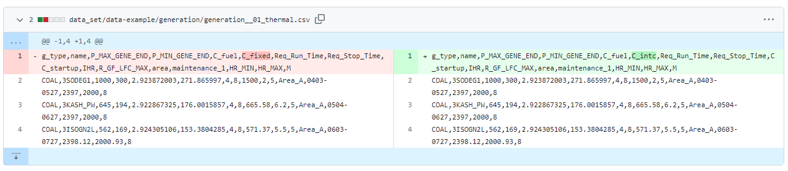
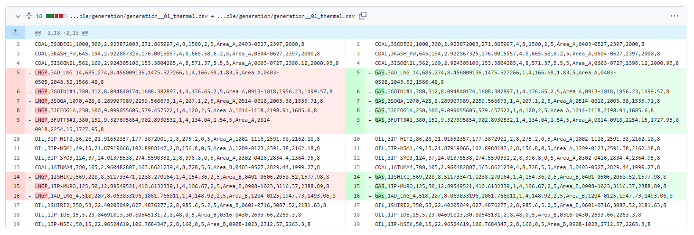
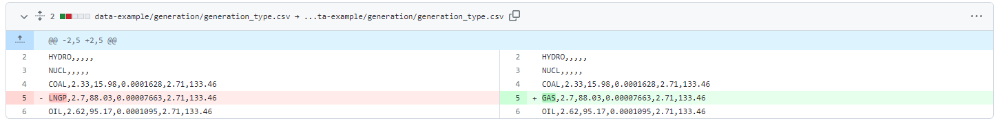
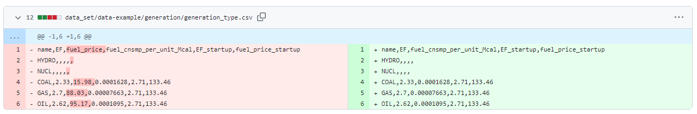

# v2で用いていた電力系統データCSVファイルからの変更方法

## 概要

2023年8月末、ucgrbの公開版としてv3がリリース、公開された。今後の研究に用いる版であるv4もプライベートリポジトリとして同時にリリースされた。
それに伴い、従来のバージョンv2と入力CSVファイルのフォーマットが一部変更された。
そのため、v2で用いていた入力CSVファイルをv3以降で用いる際には修正しなくてはいけない。
以下にその修正手順を示す。

## 手順1: ファイル名の修正

以下のcsvファイルはファイル名を修正する必要がある。

| 修正前ファイル名(v2) | 修正後ファイル名(v3以降) | 備考           |
| :------------------- | :----------------------- | :------------- |
| PV\_actual.csv       | PV\_ACT.csv              | PVの実出力値   |
| PV\_POE\_05.csv      | PV\_FCST\_U.csv          | PVの予測最大値 |
| PV\_POE\_50.csv      | PV\_FCST\_M.csv          | PVの予測値     |
| PV\_POE\_95.csv      | PV\_FCST\_L.csv          | PVの予測最小値 |
| WF\_actual.csv       | WF\_ACT.csv              | WFの実出力値   |
| WF\_POE\_05.csv      | WF\_FCST\_U.csv          | WFの予測最大値 |
| WF\_POE\_50.csv      | WF\_FCST\_M.csv          | WFの予測値     |
| WF\_POE\_95.csv      | WF\_FCST\_L.csv          | WFの予測最小値 |

上記以外のファイルは、ファイル名を修正する必要はない。

## 手順2: 項目名の修正

generation.csvにある項目名の中で、一部の項目名を変更する必要がある。
環境省プロジェクトの入力CSVファイルではgeneration\_\_01\_thermal.csv、generation\_\_02\_nuclear.csvの2つのファイルを修正する必要がある。

| 修正前項目名(v2) | 修正後項目名(v3以降) | 備考         |
| :--------------- | :------------------- | :----------- |
| C\_fixed         | C\_intc              | 無負荷コスト |
| Req_Run_Time     | Min_Up_Time          | 最小運転時間 |
| Req_Stop_Time    | Min_Down_Time        | 最小停止時間 |
| IHR              | ICR                  | 所内率       |

### 変更例

## 手順3: LNG発電機の名称変更

LNG発電機の名称がv2では「**LNGP**」だったが、v3,4では「**GAS**」に変更する必要がある。変更対象ファイルはgeneration.csv(generation\_\_01\_thermal.csv)とgeneration\_type.csvの２つである。

### 変更例1: generation.csv(generation\_\_01\_thermal.csv)

### 変更例2: generation\_type.csv

## 手順４: 必要な項目の追加
### 4.1 R_RAMP_MAX
generation.csvに、出力変化速度制約[%MW/分]を示す項目「**R_RAMP_MAX**」を追加する必要がある。
環境省プロジェクトの入力CSVファイルではgeneration__01_thermal.csv、generation__02_nuclear.csvの2つのファイルを修正する必要がある。

### 4.2 kind
generation_type.csvに、電源の種類を示す項目「**kind**」を追加する必要がある。

## 手順５: 不要な項目の削除
generation_type.csvの項目「**fuel_price**」はv2時点ですでに実際には利用していない項目であるため、対象列ごと削除することが推奨される。
### 変更例

## 手順６: 一部設定値の項目名の変更
設定ファイルconfig.ymlで設定可能な項目名が一部変更となっている。もし、利用していた場合、名称を変更する必要がある。

| 修正前項目名(v2)           | 修正後項目名(v3以降)           | 備考                                |
| :------------------------- | :----------------------------- | :---------------------------------- |
| set\_e\_ess\_plan\_constrs | set\_e\_ess\_schedule\_constrs | ESSの計画運用制約を考慮するかに否か |
| set\_e\_ess\_bc\_constrs   | set\_e\_ess\_balance\_constrs  | ESSの境界条件制約を考慮するかに否か |
