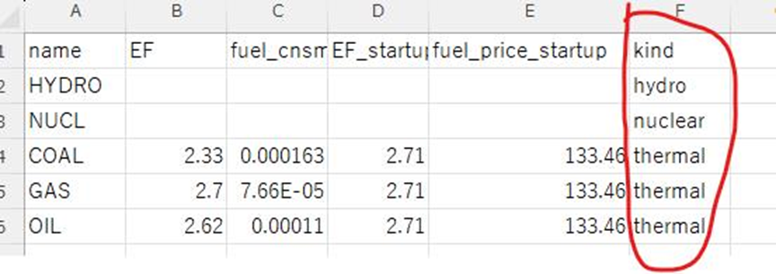

# v3で用いていた電力系統データCSVファイルからの変更方法

## 概要

2024年9月末、ucgrbの公開版としてv5がリリース、公開された。
それに伴い、従来のバージョンv3と入力CSVファイルのフォーマットが一部変更された。
そのため、v3で用いていた入力CSVファイルをv5以降で用いる際には修正しなくてはいけない。
以下にその修正手順を示す。

## 手順1: 項目名の修正

generation.csvにある項目名の中で、一部の項目名を変更する必要がある。
環境省プロジェクトの入力CSVファイルではgeneration\_\_01\_thermal.csv、generation\_\_02\_nuclear.csvの2つのファイルを修正する必要がある。

| 修正前項目名(v2) | 修正後項目名(v3以降) | 備考         |
| :--------------- | :------------------- | :----------- |
| Req_Run_Time     | Min_Up_Time          | 最小運転時間 |
| Req_Stop_Time    | Min_Down_Time        | 最小停止時間 |
| IHR              | ICR                  | 所内率       |

## 手順2: 必要な項目の追加
### 2.1 R_RAMP_MAX
generation.csvに、出力変化速度制約[%MW/分]を示す項目「**R_RAMP_MAX**」を追加する必要がある。
環境省プロジェクトの入力CSVファイルではgeneration__01_thermal.csv、generation__02_nuclear.csvの2つのファイルを修正する必要がある。

### 2.2 kind
generation_type.csvに、電源の種類を示す項目「**kind**」を追加する必要がある。

## 手順3: 一部設定値の項目名の変更
設定ファイルconfig.ymlで設定可能な項目名が一部変更となっている。もし、利用していた場合、名称を変更する必要がある。

| 修正前項目名(v2)           | 修正後項目名(v3以降)           | 備考                                |
| :------------------------- | :----------------------------- | :---------------------------------- |
| set\_e\_ess\_plan\_constrs | set\_e\_ess\_schedule\_constrs | ESSの計画運用制約を考慮するかに否か |
| set\_e\_ess\_bc\_constrs   | set\_e\_ess\_balance\_constrs  | ESSの境界条件制約を考慮するかに否か |
