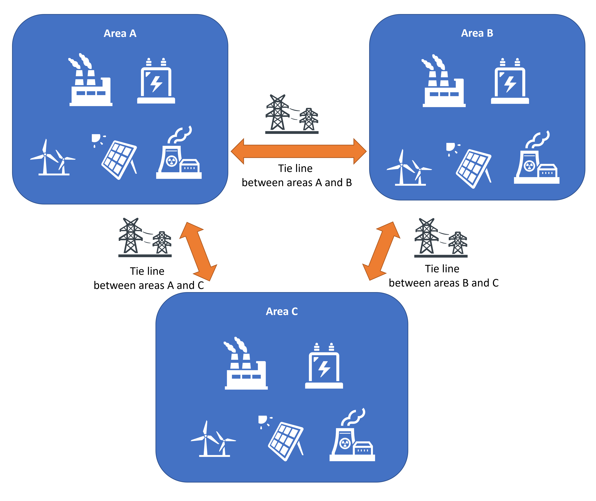
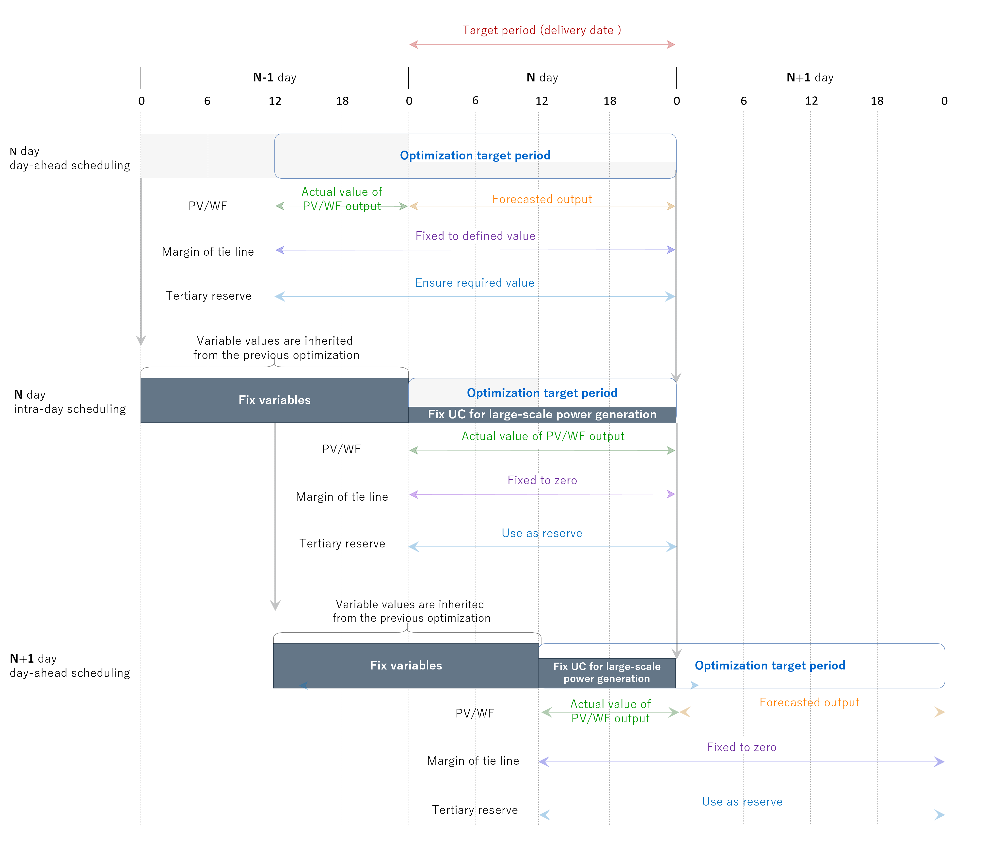
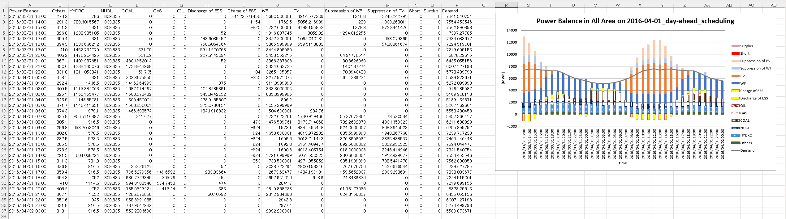

# Feature

## Features as Unit Commitment (UC)

- Conduct day-ahead scheduling and intra-day scheduling in succession so that the UC of the target period (delivery date) is fixed for the power systems in multiple areas connected by tie lines.

  

- The UC of this program is formulated in Mixed-integer linear programming (MILP). The detailed formulation can be found in Chapter 4 of the README ["Formulation of the optimization problem"](../README_EN.md#table-of-contents).

  - The objective function of the optimization is total cost minimization for all areas in the operation schedule.

  - The decision variable is the operational plan for each component of the power system.

    - Large-scale power generation
      - Thermal generation
      - Nuclear generation
      - Hydro generation
    - Energy storage system (ESS)
    - Renewable energy (RE)
      - Photovoltaic
      - Wind farm
    - Tie line

  - The main constraints are as follows.
    - Operational constraints for each component of the power system
    - Multi-area grid operation constraints
      - Power balance constraint
      - Reserve constraint
      - Inertia constant constraint

- Rolling Optimization is achieved by inheriting some of the variables determined in the previous optimization to the pre-optimization target period.

  

## Features as simulation tool

- Gurobi Optimizer is used as the solver for MILP. A purchased license is required to solve large scale problems.
- Even if you do not have a license for Gurobi Optimizer, you can output MILP in MPS file format for implementation in other solver tools.
- Various parameters of the power system to be optimized should be described in a CSV file and placed in a specific directory.
- The results of each round in the rolling optimization are saved in separate XLSX files.

- Depending on the configuration, optimization results for all decision variables can be output in JSON file.

- The conditions for optimization can be easily changed by editing the description in the configuration file. The main configuration items can be found in Chapter 6 of the README ["List of setting values"](../README_EN.md#table-of-contents).

- This simulation tool consists of three classes and two functions. By referring to, editing, and combining these classes, it is possible to construct simulation models with a high degree of freedom.
  - Class "**UCData**": Loads and saves configuration files and power system models.
  - Class "**UCDicts**": The power system model loaded by "UCData" is converted to a dictionary type and stored so that it can be used in the Gurobi model.
  - Class "**UCVars**": save a part of the optimization results and fix a part of the Gurobi model decision variables created by the function "make_grb_model" by referring to the saved contents.
  - Function "**make_grb_model**": Generates a Gurobi model based on "UCData" and "UCDicts".
  - Function "**output_result**": Outputs and saves the optimization results as an xlsx file, etc.
