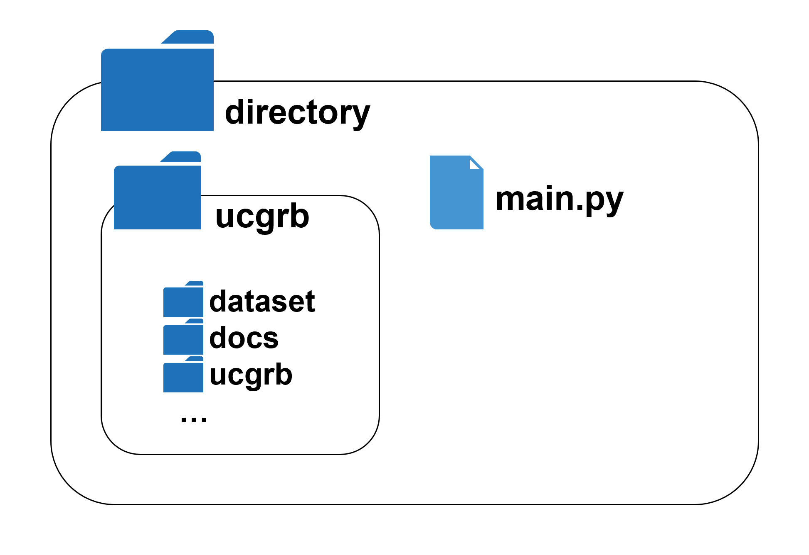
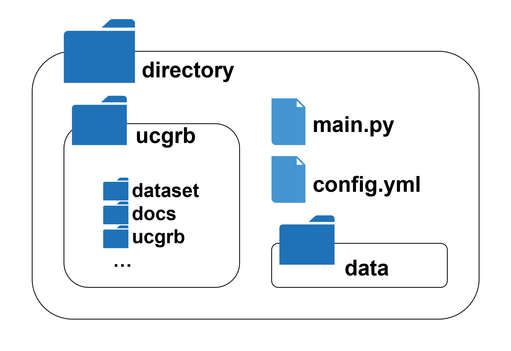
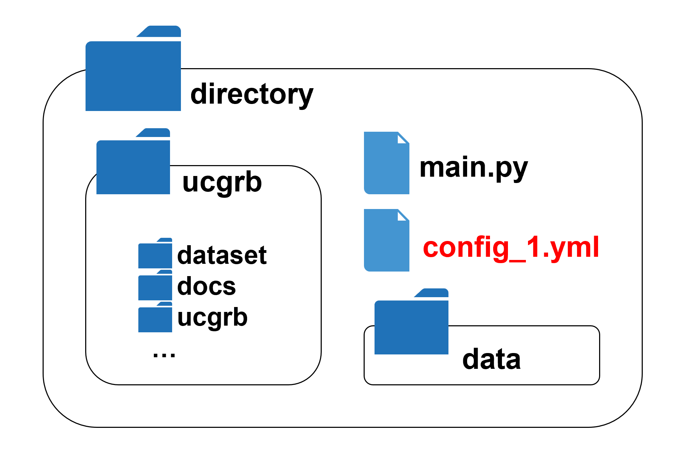
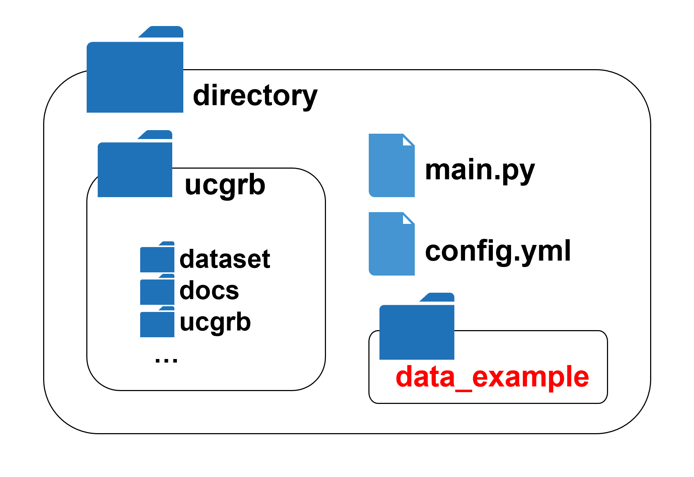

## Execution methods - If you have a user license Gurobi Optimizer -

## 1. Execution check

If not otherwise specified, optimization is performed under the following conditions.

- Input data ["data-example"](../../data_set/data-example): this is a small-scale power system data for execution check. Power system data: Small-scale system data  for execution check.
- Target Period (delivery date): April 1, 2016 only

The procedure is as follows:

1. Clone this registry.


2. Write the following script in the file "main.py" and save in the same directory as this registry.

   ```python:main.py
   from ucgrb.ucgrb import ucgrb

   ucgrb()
   ```

   

3. Open a console such as PowerShell, go to the registry (ucgrb), and set up the poetry virtual environment

  ```cmd
  cd ucgrb
  poetry install
  ```

4. Run "main.py" on the virtual environment. There are mainly two methods.

   - Start VScode or spyder, open "main.py" and execute it.

   - Open the console, change the working directory to the location where main.py is located using cd command, and execute the following command:

     ```cmd
     python main.py
     ```

5. The directory "result" is created in the root directory of this repository, and the execution information file "info.txt" and result files (xlsx, json.zip) are output in the result directory.

## 2. Reading a configuration files and power system data

Put a file "config.yml" for your configuration, a directory "data" containing the power system data (in CSV file), and a file "main.py" in the same directory as the below figure, then execute "main.py."

For example, to implement the day-ahead and real-time schedule for April 1, 2016, and the day-ahead plan for April 2, 2016, describe the config.yml as follows.

```yml
start_date: "2016-04-01"
```

  

## 3. Rename the configuration file

For example, if you want to change the name of the configuration file to "config_1.yml", simply change the description of "main.py" as follows:

```python
from ucgrb.ucgrb import ucgrb

ucgrb("config_1.yml")
```

  

## 4. Rename power system data directory

For example, if you want to change the name of the directory containing the power system data (CSV file) to "data-mod", simply add the following description to "config.yml".

```yml
start_date: "2016-04-01"
csv_data_dir: "data-mod"
```

  
