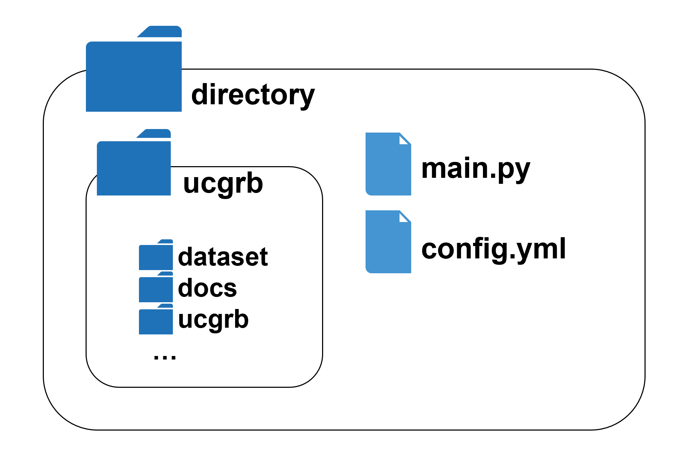

# Execute on a small model - If you don't have a Gurobi Optimizer license -

If you do not have a paid license for Gurobi Optimizer, you must use a restricted license and cannot use "data-example" because the scale of the problem is too large. Therefore, the library provides "data-mini," which is a smaller-scale power system data that can be implemented with a restricted license.

As an example, we show the procedure for implementation with the following settings, which can also be implemented with the license for restricted version.

- Input data: small-scale power system data ["data-mini"](../../data_set/data-mini) that can be implemented with a limited version license
- Target Period: 9 hours from 13:00 to 21:00 on April 1, 2016
- Required tertiary reserve constraints: not taken into consideration
- ESS operational constraints: Boundary conditions (stored energy at 12:00 and 21:00 must be 50%)

The procedure is as follows:

1. Clone this registry.
     - **Caution!** When cloning, the directory name must be changed to "**ucgrb**" instead of "**ucgrb-private**". For example, when cloning with the command, it must be written as follows.

       ```cmd
       git clone https://github.com/YamaLabTUS/ucgrb-private.git ucgrb
       ```
       **Reference: [https://git-scm.com/book/en/v2/Git-Basics-Getting-a-Git-Repository](https://git-scm.com/book/en/v2/Git-Basics-Getting-a-Git-Repository)**


2. Create the following script "main.py" and configuration file "config.yml" in the same directory as this registry.

   **main.py**

   ```python
   from ucgrb.ucgrb import ucgrb

   ucgrb()
   ```

   **config.yml**

   ```yaml
   config_name: "Without License Test"
   csv_data_dir: "ucgrb/data_set/data-mini"
   rolling_opt_list:
     - name: "2016-04-01_scheduling"
       start_time: "2016-04-01 13:00:00"
       end_time: "2016-04-01 21:00:00"
       pre_period_hours: 8
       pv_value:
         "2016-04-01 13:00:00": "ACT"
       wf_value:
         "2016-04-01 13:00:00": "ACT"
       fix_tie_margin_to_zero: True
       fix_required_tertiary_reserve_to_zero: True
   make_e_ess_plan_dicts: False
   ```

   

3. Open a console such as PowerShell, go to the registry (ucgrb), and set up the poetry virtual environment.

  ```cmd
  cd ucgrb
  poetry install
  ```

4. Run "main.py" on the virtual environment. There are mainly two methods.

   - Enter the poetry virtual environment shell, change the working directory to the location where main.py is located using cd command, and run `python main.py`.

     ```cmd
     poetry shell
     cd ../
     python main.py
     ```

   - After starting VScode or spyder and specifying the interpolator as the poetry virtual environment, open “main.py” and execute it.


5. The directory "result" is created in the root directory of this repository, and the execution information file "info.txt" and result files (xlsx, json.zip) are output in the result directory.
