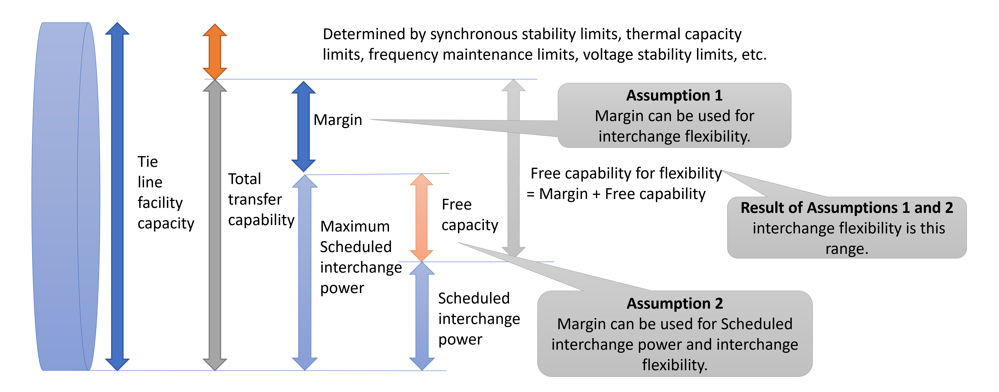
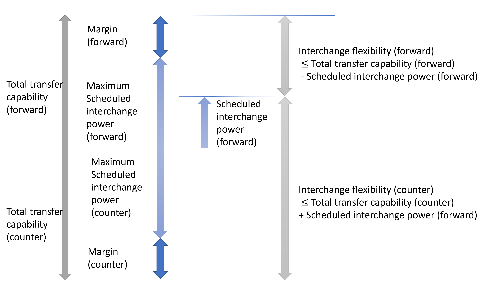
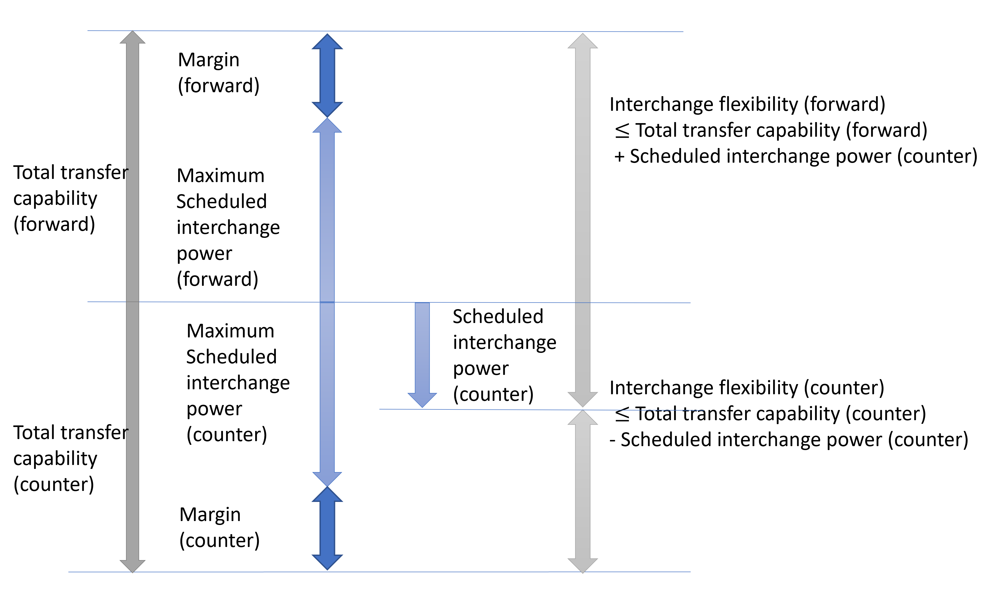

# Constraints on tie line
The tie lines connecting the multiple areas can be considered.

- Power can be flexibly transferred between connected areas. Transmission losses cannot be taken into account. Instead, a penalty is incurred in proportion to the amount of electricity transmitted, which is added to the objective function (cost).
- GF and LFC reserve and tertiary reserve can also be flexible.
  - By changing the setting, the reserve can be limited.
- •	You can choose to specify total transfer capability (TTC) and margin of tie line as a fixed value for the entire period, by month or time period, or by optimization time granularity. The default is fixed for the entire period.
- The margin secured in day-ahead scheduling is zero for intra-day scheduling. This allows more inter-regional flexible capacity to be available than in intra-day scheduling. This tool can choose to retain the same amount of margin as day-ahead scheduling for intra-day scheduling. By default, the margin for intra-day scheduling is set to 0.

See the following pages for definitions of each set, index, constant, and variable.
- [Sets and indies](../03_set_and_index.md)
- Parameters
  1. [Parameters for area](../04_parameter/01_area.md)
  2. [Parameters for large-scale power generation](../04_parameter/02_generation.md)
  3. [Parameters for renewable energy](../04_parameter/03_re.md)
  4. [Parameters for energy storage system](../04_parameter/04_ess.md)
  5. [Parameters for tie line](../04_parameter/05_tie.md)
  6. [Parameters that depends on scheduling kind](../04_parameter/06_depend_on_scheduling_kind.md)
- Variables
  1. [Variables for area](../05_variable/01_area.md)
  2. [Variables for large-scale power generation](../05_variable/02_generation.md)
  3. [Variables for renewable energy](../05_variable/03_re.md)
  4. [Variables for energy storage system](../05_variable/04_ess.md)
  5. [Variables for tie line](../05_variable/05_tie.md)

## Interchange power constraint for tie lines

$$
\begin{align}
   p_{t,tie}^{\text{forward}}
    & \leq \left( P_{t,tie}^{\text{TTC, forward}} -
   P_{t,tie}^{\text{Margin, forward}} \right) d_{t,tie}
    & \forall t \in T, \forall tie \in \textit{TIE}
    & \qquad (1)
\\
   p_{t,tie}^{\text{counter}}
    & \leq \left( P_{t,tie}^{\text{TTC, counter}} -
   P_{t,tie}^{\text{Margin, counter}} \right) ( 1- d_{t,tie} )
    & \forall t \in T, \forall tie \in \textit{TIE}
    & \qquad (2)
\end{align}
$$

## Power flow direction of GF&LFC reserve constraints for tie lines

$$
\begin{align}
   p_{t,tie}^{\text{GF\\&LFC}\,\text{UP, forward}}
    & \leq \left( P_{t,tie}^{\text{TTC, forward}} +
   P_{t,tie}^{\text{TTC, counter}} \right) d_{t,tie}^{\text{GF\\&LFC}\,\text{UP}}
    & \forall t \in T, \forall tie \in \textit{TIE}
    & \qquad (1)
\\
   p_{t,tie}^{\text{GF\\&LFC}\,\text{UP, counter}}
    & \leq \left( P_{t,tie}^{\text{TTC, forward}} +
   P_{t,tie}^{\text{TTC, counter}} \right) \left( 1 - d_{t,tie}^{\text{GF\\&LFC}\,\text{UP}} \right)
    & \forall t \in T, \forall tie \in \textit{TIE}
    & \qquad (2)
\\
   p_{t,tie}^{\text{GF\\&LFC}\,\text{DOWN, forward}}
    & \leq \left( P_{t,tie}^{\text{TTC, forward}} +
   P_{t,tie}^{\text{TTC, counter}} \right) d_{t,tie}^{\text{GF\\&LFC}\,\text{DOWN}}
    & \forall t \in T, \forall tie \in \textit{TIE}
    & \qquad (3)
\\
   p_{t,tie}^{\text{GF\\&LFC}\,\text{DOWN, counter}}
    & \leq \left( P_{t,tie}^{\text{TTC, forward}} +
   P_{t,tie}^{\text{TTC, counter}} \right) \left( 1 - d_{t,tie}^{\text{GF\\&LFC}\,\text{DOWN}} \right)
    & \forall t \in T, \forall tie \in \textit{TIE}
    & \qquad (4)
\end{align}
$$

## Power flow direction of tertiary reserve constraints for tie lines

$$
\begin{align}
   p_{t,tie}^{\text{Tert}\,\text{UP, forward}}
    & \leq \left( P_{t,tie}^{\text{TTC, forward}} +
   P_{t,tie}^{\text{TTC, counter}} \right) d_{t,tie}^{\text{Tert}\,\text{UP}}
    & \forall t \in T, \forall tie \in \textit{TIE}
    & \qquad (1)
\\
   p_{t,tie}^{\text{Tert}\,\text{UP, counter}}
    & \leq \left( P_{t,tie}^{\text{TTC, forward}} +
   P_{t,tie}^{\text{TTC, counter}} \right) \left( 1 - d_{t,tie}^{\text{Tert}\,\text{UP}} \right)
    & \forall t \in T, \forall tie \in \textit{TIE}
    & \qquad (2)
\\
  p_{t,tie}^{\text{Tert}\,\text{DOWN, forward}}
    & \leq \left( P_{t,tie}^{\text{TTC, forward}} +
   P_{t,tie}^{\text{TTC, counter}} \right) d_{t,tie}^{\text{Tert}\,\text{DOWN}}
    & \forall t \in T, \forall tie \in \textit{TIE}
    & \qquad (3)
\\
   p_{t,tie}^{\text{Tert}\,\text{DOWN, counter}}
    & \leq \left( P_{t,tie}^{\text{TTC, forward}} +
   P_{t,tie}^{\text{TTC, counter}} \right) \left( 1 - d_{t,tie}^{\text{Tert}\,\text{DOWN}} \right)
    & \forall t \in T, \forall tie \in \textit{TIE}
    & \qquad (4)
\end{align}
$$

## Maximum interchange flexibility constraints for tie lines

$$
\begin{align}
   p_{t,tie}^{\text{GF\\&LFC}\,\text{UP, forward}} + p_{t,tie}^{\text{Tert}\,\text{UP, forward}}
    & \leq P_{t,tie}^{\text{TTC, forward}} - p_{t,tie}^{\text{forward}} + p_{t,tie}^{\text{counter}}
    & \forall t \in T, \forall tie \in \textit{TIE}
    & \qquad (1)
\\
   p_{t,tie}^{\text{GF\\&LFC}\,\text{UP, counter}} + p_{t,tie}^{\text{Tert}\,\text{UP, counter}}
    & \leq P_{t,tie}^{\text{TTC, counter}} - p_{t,tie}^{\text{counter}} + p_{t,tie}^{\text{forward}}
    & \forall t \in T, \forall tie \in \textit{TIE}
    & \qquad (2)
\\
   p_{t,tie}^{\text{GF\\&LFC}\,\text{DOWN, forward}} + p_{t,tie}^{\text{Tert}\,\text{DOWN, forward}}
    & \leq P_{t,tie}^{\text{TTC, counter}} - p_{t,tie}^{\text{counter}} + p_{t,tie}^{\text{forward}}
    & \forall t \in T, \forall tie \in \textit{TIE}
    & \qquad (3)
\\
   p_{t,tie}^{\text{GF\\&LFC}\,\text{DOWN, counter}} + p_{t,tie}^{\text{Tert}\,\text{DOWN, counter}}
    & \leq P_{t,tie}^{\text{TTC, forward}} - p_{t,tie}^{\text{forward}} + p_{t,tie}^{\text{counter}}
    & \forall t \in T, \forall tie \in \textit{TIE}
    & \qquad (4)
\end{align}
$$

$$
\begin{align}
   p_{t,tie}^{\text{GF\\&LFC}\,\text{UP, forward}}
    & \leq P_{t,tie}^{\text{GF\\&LFC}\,\text{UP, forwardMAX}}
    & \forall t \in T, \forall tie \in \textit{TIE}
    & \qquad (5)
\\
   p_{t,tie}^{\text{GF\\&LFC}\,\text{UP, counter}}
    & \leq P_{t,tie}^{\text{GF\\&LFC}\,\text{UP, counterMAX}}
    & \forall t \in T, \forall tie \in \textit{TIE}
    & \qquad (6)
\\
   p_{t,tie}^{\text{GF\\&LFC}\,\text{DOWN, forward}}
    & \leq P_{t,tie}^{\text{GF\\&LFC}\,\text{DOWN, forwardMAX}}
    & \forall t \in T, \forall tie \in \textit{TIE}
    & \qquad (7)
\\
   p_{t,tie}^{\text{GF\\&LFC}\,\text{DOWN, counter}}
    & \leq P_{t,tie}^{\text{GF\\&LFC}\,\text{DOWN, counterMAX}}
    & \forall t \in T, \forall tie \in \textit{TIE}
    & \qquad (8)
\end{align}
$$

$$
\begin{align}
   p_{t,tie}^{\text{Tert}\,\text{UP, forward}}
    & \leq P_{t,tie}^{\text{Tert}\,\text{UP, forwardMAX}}
    & \forall t \in T, \forall tie \in \textit{TIE}
    & \qquad (9)
\\
   p_{t,tie}^{\text{Tert}\,\text{UP, counter}}
    & \leq P_{t,tie}^{\text{Tert}\,\text{UP, counterMAX}}
    & \forall t \in T, \forall tie \in \textit{TIE}
    & \qquad (10)
\\
   p_{t,tie}^{\text{Tert}\,\text{DOWN, forward}}
    & \leq P_{t,tie}^{\text{Tert}\,\text{DOWN, forwardMAX}}
    & \forall t \in T, \forall tie \in \textit{TIE}
    & \qquad (11)
\\
   p_{t,tie}^{\text{Tert}\,\text{DOWN, counter}}
    & \leq P_{t,tie}^{\text{Tert}\,\text{DOWN, counterMAX}}
    & \forall t \in T, \forall tie \in \textit{TIE}
    & \qquad (12)
\end{align}
$$

| Condition name                                                         | Default value | Setting name on the configuration file       | Change from the above formula when set to False                                                                                                         |
| :--------------------------------------------------------------------- | :------------ | :------------------------------------------- | :------------------------------------------------------------------------------------------------------------------------------------------------------ |
| Availability of power supply through tie lines                         | True          | flexible_p_tie                               | interchange power $p_{t,tie}^{\text{forward}}$ , $p_{t,tie}^{\text{counter}}$ are fixed at 0                                                            |
| Depends on the tie line GF&LFC Up-reserve flexible or not              | True          | flexible_p_tie_gf_lfc_up                     | interchange GF&LFC up-reserve $p_{t,tie}^{\text{GF\\&LFC}\,\text{UP, forward}}$ , $p_{t,tie}^{\text{GF\\&LFC}\,\text{UP, counter}}$ are fixed at 0      |
| Depends on the tie line GF&LFC Down-reserve flexible or not            | False         | flexible_p_tie_gf_lfc_down                   | interchange GF&LFC down-reserve $p_{t,tie}^{\text{GF\\&LFC}\,\text{DOWN, forward}}$ , $p_{t,tie}^{\text{GF\\&LFC}\,\text{DOWN, counter}}$ is fixed at 0 |
| Depends on the tie line tertiary Up-reserve Flexibility                | True          | flexible_p_tie_tert_up                       | Fused tertiary up-reserve $p_{t,tie}^{\text{Tert}\,\text{UP, forward}}$ , $p_{t,tie}^{\text{Tert}\,\text{UP, counter}}$ is fixed at 0                   |
| Depends on the tie line tertiary down-reserve flexible or not          | False         | flexible_p_tie_tert_down                     | Fused tertiary down-reserve $p_{t,tie}^{\text{Tert}\,\text{DOWN, forward}}$ , $p_{t,tie}^{\text{Tert}\,\text{DOWN, counter}}$ is fixed at 0             |
| Consideration of operational capacity constraints of tie lines         | True          | consider_TTC                                 | operating capacity $P_{t,tie}^{\text{TTC, forward}}$ , $P_{t,tie}^{\text{TTC, counter}}$ to 100 times                                                   |
| Consideration of maximum flexibility reserve constraints for tie lines | False         | consider_maximum_ reserve_constraint_for_tie | Equations (5) through (12) of the maximum flexibility reserve constraint of the tie line are not considered                                             |
| Consideration of operating margins for tie lines in day-ahead planning | False         | consider_tie_margin_in_intra-day             | intra-day planning only, operational margin of tie lines $P_{t,tie}^{\text{Margin, forward}}$ , $P_{t,tie}^{\text{Margin, counter}}$ to 0.              |
