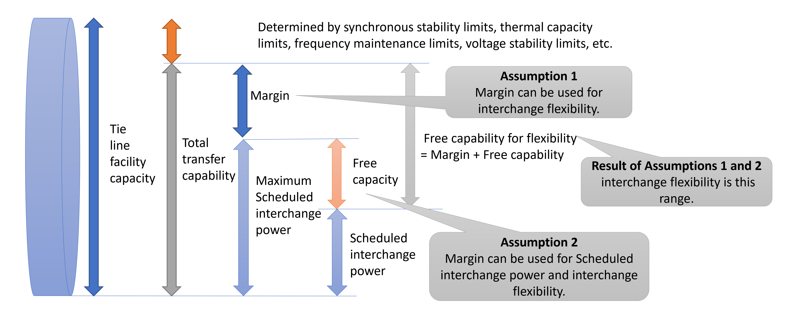
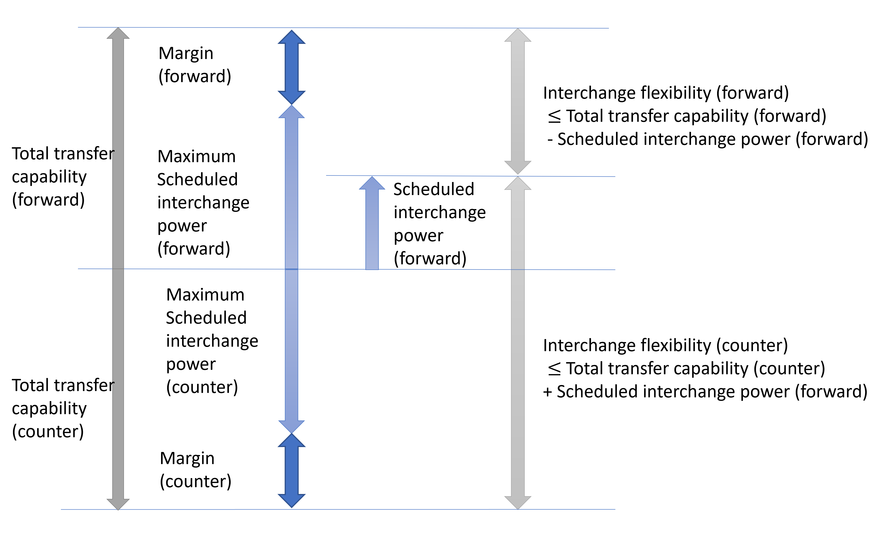
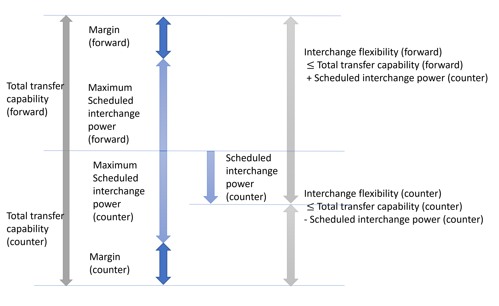

# Constraints on tie line
The tie lines connecting the multiple areas can be considered.

- Power can be interchanged between the connected areas. Transmission losses cannot be taken into account. Instead, a penalty is incurred in proportion to the amount of interchanged electricity, which is added to the objective function (cost).
- GF&LFC reserve and tertiary reserve can also be interchanged.
  - By changing the setting, the interchangeable reserve can be limited.
- You can choose to specify the total transfer capability (TTC) and margin of the tie line as a fixed value for the entire period, by month or time period, or per optimization time granularity. By default, it is fixed for the entire period.
- The margin secured in day-ahead scheduling can either become 0 in intra-day scheduling, making more inter-regional interchange capacity available than in day-ahead scheduling, or be retained at the same amount in intra-day scheduling; you can choose between these. By default, the margin in intra-day scheduling is set to 0.

See the following pages for definitions of each set, index, constant, and variable.
- [Sets and indices](../03_set_and_index.md)
- Parameters
  1. [Parameters for area](../04_parameter/01_area.md)
  2. [Parameters for large-scale power generation](../04_parameter/02_generation.md)
  3. [Parameters for renewable energy](../04_parameter/03_re.md)
  4. [Parameters for energy storage system](../04_parameter/04_ess.md)
  5. [Parameters for tie line](../04_parameter/05_tie.md)
  6. [Parameters that depends on scheduling kind](../04_parameter/06_depend_on_scheduling_kind.md)
- Variables
  1. [Variables for area](../05_variable/01_area.md)
  2. [Variables for large-scale power generation](../05_variable/02_generation.md)
  3. [Variables for renewable energy](../05_variable/03_re.md)
  4. [Variables for energy storage system](../05_variable/04_ess.md)
  5. [Variables for tie line](../05_variable/05_tie.md)

## 1. Interchange power constraint for tie lines

$$
\begin{aligned}
   p_{t,tie}^{\text{forward}}
    & \leq \left( P_{t,tie}^{\text{TTC, forward}} -
   P_{t,tie}^{\text{Margin, forward}} \right) d_{t,tie}
    & \forall t \in T, \forall tie \in \textit{TIE}
    & \qquad (2\text{-}5\text{-}1\text{-}1)
\\
   p_{t,tie}^{\text{counter}}
    & \leq \left( P_{t,tie}^{\text{TTC, counter}} -
   P_{t,tie}^{\text{Margin, counter}} \right) ( 1- d_{t,tie} )
    & \forall t \in T, \forall tie \in \textit{TIE}
    & \qquad (2\text{-}5\text{-}1\text{-}2)
\end{aligned}
$$

## 2. Power flow direction of interchanged GF&LFC reserve constraints for tie lines

$$
\begin{aligned}
   p_{t,tie}^{\text{GF\\&LFC}\,\text{UP, forward}}
    & \leq \left( P_{t,tie}^{\text{TTC, forward}} +
   P_{t,tie}^{\text{TTC, counter}} \right) d_{t,tie}^{\text{GF\\&LFC}\,\text{UP}}
    & \forall t \in T, \forall tie \in \textit{TIE}
    & \qquad (2\text{-}5\text{-}2\text{-}1)
\\
   p_{t,tie}^{\text{GF\\&LFC}\,\text{UP, counter}}
    & \leq \left( P_{t,tie}^{\text{TTC, forward}} +
   P_{t,tie}^{\text{TTC, counter}} \right) \left( 1 - d_{t,tie}^{\text{GF\\&LFC}\,\text{UP}} \right)
    & \forall t \in T, \forall tie \in \textit{TIE}
    & \qquad (2\text{-}5\text{-}2\text{-}2)
\\
   p_{t,tie}^{\text{GF\\&LFC}\,\text{DOWN, forward}}
    & \leq \left( P_{t,tie}^{\text{TTC, forward}} +
   P_{t,tie}^{\text{TTC, counter}} \right) d_{t,tie}^{\text{GF\\&LFC}\,\text{DOWN}}
    & \forall t \in T, \forall tie \in \textit{TIE}
    & \qquad (2\text{-}5\text{-}2\text{-}3)
\\
   p_{t,tie}^{\text{GF\\&LFC}\,\text{DOWN, counter}}
    & \leq \left( P_{t,tie}^{\text{TTC, forward}} +
   P_{t,tie}^{\text{TTC, counter}} \right) \left( 1 - d_{t,tie}^{\text{GF\\&LFC}\,\text{DOWN}} \right)
    & \forall t \in T, \forall tie \in \textit{TIE}
    & \qquad (2\text{-}5\text{-}2\text{-}4)
\end{aligned}
$$

## 3. Power flow direction of interchanged tertiary reserve constraints for tie lines

$$
\begin{aligned}
   p_{t,tie}^{\text{Tert}\,\text{UP, forward}}
    & \leq \left( P_{t,tie}^{\text{TTC, forward}} +
   P_{t,tie}^{\text{TTC, counter}} \right) d_{t,tie}^{\text{Tert}\,\text{UP}}
    & \forall t \in T, \forall tie \in \textit{TIE}
    & \qquad (2\text{-}5\text{-}3\text{-}1)
\\
   p_{t,tie}^{\text{Tert}\,\text{UP, counter}}
    & \leq \left( P_{t,tie}^{\text{TTC, forward}} +
   P_{t,tie}^{\text{TTC, counter}} \right) \left( 1 - d_{t,tie}^{\text{Tert}\,\text{UP}} \right)
    & \forall t \in T, \forall tie \in \textit{TIE}
    & \qquad (2\text{-}5\text{-}3\text{-}2)
\\
  p_{t,tie}^{\text{Tert}\,\text{DOWN, forward}}
    & \leq \left( P_{t,tie}^{\text{TTC, forward}} +
   P_{t,tie}^{\text{TTC, counter}} \right) d_{t,tie}^{\text{Tert}\,\text{DOWN}}
    & \forall t \in T, \forall tie \in \textit{TIE}
    & \qquad (2\text{-}5\text{-}3\text{-}3)
\\
   p_{t,tie}^{\text{Tert}\,\text{DOWN, counter}}
    & \leq \left( P_{t,tie}^{\text{TTC, forward}} +
   P_{t,tie}^{\text{TTC, counter}} \right) \left( 1 - d_{t,tie}^{\text{Tert}\,\text{DOWN}} \right)
    & \forall t \in T, \forall tie \in \textit{TIE}
    & \qquad (2\text{-}5\text{-}3\text{-}4)
\end{aligned}
$$

## 4. Maximum interchange reserve constraints for tie lines

$$
\begin{aligned}
   p_{t,tie}^{\text{GF\\&LFC}\,\text{UP, forward}} + p_{t,tie}^{\text{Tert}\,\text{UP, forward}}
    & \leq P_{t,tie}^{\text{TTC, forward}} - p_{t,tie}^{\text{forward}} + p_{t,tie}^{\text{counter}}
    & \forall t \in T, \forall tie \in \textit{TIE}
    & \qquad (2\text{-}5\text{-}4\text{-}1)
\\
   p_{t,tie}^{\text{GF\\&LFC}\,\text{UP, counter}} + p_{t,tie}^{\text{Tert}\,\text{UP, counter}}
    & \leq P_{t,tie}^{\text{TTC, counter}} - p_{t,tie}^{\text{counter}} + p_{t,tie}^{\text{forward}}
    & \forall t \in T, \forall tie \in \textit{TIE}
    & \qquad (2\text{-}5\text{-}4\text{-}2)
\\
   p_{t,tie}^{\text{GF\\&LFC}\,\text{DOWN, forward}} + p_{t,tie}^{\text{Tert}\,\text{DOWN, forward}}
    & \leq P_{t,tie}^{\text{TTC, counter}} - p_{t,tie}^{\text{counter}} + p_{t,tie}^{\text{forward}}
    & \forall t \in T, \forall tie \in \textit{TIE}
    & \qquad (2\text{-}5\text{-}4\text{-}3)
\\
   p_{t,tie}^{\text{GF\\&LFC}\,\text{DOWN, counter}} + p_{t,tie}^{\text{Tert}\,\text{DOWN, counter}}
    & \leq P_{t,tie}^{\text{TTC, forward}} - p_{t,tie}^{\text{forward}} + p_{t,tie}^{\text{counter}}
    & \forall t \in T, \forall tie \in \textit{TIE}
    & \qquad (2\text{-}5\text{-}4\text{-}4)
\end{aligned}
$$

$$
\begin{aligned}
   p_{t,tie}^{\text{GF\\&LFC}\,\text{UP, forward}}
    & \leq P_{t,tie}^{\text{GF\\&LFC}\,\text{UP, forwardMAX}}
    & \forall t \in T, \forall tie \in \textit{TIE}
    & \qquad (2\text{-}5\text{-}4\text{-}5)
\\
   p_{t,tie}^{\text{GF\\&LFC}\,\text{UP, counter}}
    & \leq P_{t,tie}^{\text{GF\\&LFC}\,\text{UP, counterMAX}}
    & \forall t \in T, \forall tie \in \textit{TIE}
    & \qquad (2\text{-}5\text{-}4\text{-}6)
\\
   p_{t,tie}^{\text{GF\\&LFC}\,\text{DOWN, forward}}
    & \leq P_{t,tie}^{\text{GF\\&LFC}\,\text{DOWN, forwardMAX}}
    & \forall t \in T, \forall tie \in \textit{TIE}
    & \qquad (2\text{-}5\text{-}4\text{-}7)
\\
   p_{t,tie}^{\text{GF\\&LFC}\,\text{DOWN, counter}}
    & \leq P_{t,tie}^{\text{GF\\&LFC}\,\text{DOWN, counterMAX}}
    & \forall t \in T, \forall tie \in \textit{TIE}
    & \qquad (2\text{-}5\text{-}4\text{-}8)
\end{aligned}
$$

$$
\begin{aligned}
   p_{t,tie}^{\text{Tert}\,\text{UP, forward}}
    & \leq P_{t,tie}^{\text{Tert}\,\text{UP, forwardMAX}}
    & \forall t \in T, \forall tie \in \textit{TIE}
    & \qquad (2\text{-}5\text{-}4\text{-}9)
\\
   p_{t,tie}^{\text{Tert}\,\text{UP, counter}}
    & \leq P_{t,tie}^{\text{Tert}\,\text{UP, counterMAX}}
    & \forall t \in T, \forall tie \in \textit{TIE}
    & \qquad (2\text{-}5\text{-}4\text{-}10)
\\
   p_{t,tie}^{\text{Tert}\,\text{DOWN, forward}}
    & \leq P_{t,tie}^{\text{Tert}\,\text{DOWN, forwardMAX}}
    & \forall t \in T, \forall tie \in \textit{TIE}
    & \qquad (2\text{-}5\text{-}4\text{-}11)
\\
   p_{t,tie}^{\text{Tert}\,\text{DOWN, counter}}
    & \leq P_{t,tie}^{\text{Tert}\,\text{DOWN, counterMAX}}
    & \forall t \in T, \forall tie \in \textit{TIE}
    & \qquad (2\text{-}5\text{-}4\text{-}12)
\end{aligned}
$$

| Condition name                                                       | Default value | Setting name on the configuration file       | Change from the above formula when set to False                                                                                                       |
| :------------------------------------------------------------------- | :------------ | :------------------------------------------- | :--------------------------------------------------------------------------------------------------------------------------------------------------- |
| Availability of power interchange through tie lines                  | True          | flexible_p_tie                               | Fix the interchange power $p_{t,tie}^{\text{forward}}$ , $p_{t,tie}^{\text{counter}}$ to 0                                                            |
| Availability of GF&LFC up-reserve interchange through tie lines      | True          | flexible_p_tie_gf_lfc_up                     | Fix the interchanged GF&LFC up-reserve $p_{t,tie}^{\text{GF\\&LFC}\,\text{UP, forward}}$ , $p_{t,tie}^{\text{GF\\&LFC}\,\text{UP, counter}}$ to 0     |
| Availability of GF&LFC down-reserve interchange through tie lines    | False         | flexible_p_tie_gf_lfc_down                   | Fix the interchanged GF&LFC down-reserve $p_{t,tie}^{\text{GF\\&LFC}\,\text{DOWN, forward}}$ , $p_{t,tie}^{\text{GF\\&LFC}\,\text{DOWN, counter}}$ to 0 |
| Availability of tertiary up-reserve interchange through tie lines    | True          | flexible_p_tie_tert_up                       | Fix the interchanged tertiary up-reserve $p_{t,tie}^{\text{Tert}\,\text{UP, forward}}$ , $p_{t,tie}^{\text{Tert}\,\text{UP, counter}}$ to 0          |
| Availability of tertiary down-reserve interchange through tie lines  | False         | flexible_p_tie_tert_down                     | Fix the interchanged tertiary down-reserve $p_{t,tie}^{\text{Tert}\,\text{DOWN, forward}}$ , $p_{t,tie}^{\text{Tert}\,\text{DOWN, counter}}$ to 0    |
| Consideration of TTC constraints for tie lines                      | True          | consider_TTC                                 | Multiply the TTC $P_{t,tie}^{\text{TTC, forward}}$ , $P_{t,tie}^{\text{TTC, counter}}$ by 100                                                        |
| Consideration of maximum interchange reserve constraints for tie lines | False       | consider_maximum_reserve_constraint_for_tie | Equations (2-5-4-5) through (2-5-4-12) of the maximum interchange reserve constraint for tie lines are not considered                                 |
| Consideration of operational margins for tie lines in intra-day scheduling | False   | consider_tie_margin_in_intra-day             | In intra-day scheduling only, set the operational margins of tie lines $P_{t,tie}^{\text{Margin, forward}}$ , $P_{t,tie}^{\text{Margin, counter}}$ to 0. |
