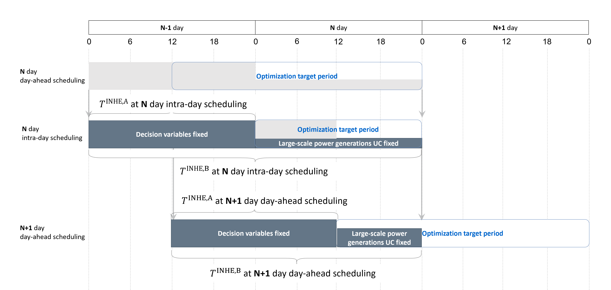

# Constraints on rolling optimization

Rolling optimization is achieved by taking over some of the variables determined in the previous optimization to the pre-optimization target time period. The variables to be taken over are as follows.

- Generation of large-scale power generations $p_{t,g}$
- Variables related to nuclear and thermal power start-up and shutdown plans $u_{t,g}$, $su_{t,g}$, $sd_{t,g}$
- Energy storage capacity of energy storage systems $e_{t,ess}$

- Each variable has a different target period to inherit.
  - Inheritance period for variables $p_{t,g}$ and $e_{t,ess}$ $T^{\text{INHE,A}}$
    - Start time: Start time of the period for which the variable is prepared before the next period to be optimized.
    - End time: Time before the next optimization period.
  - Inheritance period for variables $u_{t,g}$, $su_{t,g}$, and $sd_{t,g}$ related to nuclear and thermal power start-up and shutdown plans $T^{\text{INHE,B}}$
    - Start time: Start time of the period for which the variable is prepared before the next period to be optimized.
    - End time: Last time of the current optimization period

See the following pages for definitions of each set, index, constant, and variable.
- [Sets and indies](../03_set_and_index.md)
- Parameters
  1. [Parameters for area](../04_parameter/01_area.md)
  2. [Parameters for large-scale power generation](../04_parameter/02_generation.md)
  3. [Parameters for renewable energy](../04_parameter/03_re.md)
  4. [Parameters for energy storage system](../04_parameter/04_ess.md)
  5. [Parameters for tie line](../04_parameter/05_tie.md)
  6. [Parameters that depends on scheduling kind](../04_parameter/06_depend_on_scheduling_kind.md)
- Variables
  1. [Variables for area](../05_variable/01_area.md)
  2. [Variables for large-scale power generation](../05_variable/02_generation.md)
  3. [Variables for renewable energy](../05_variable/03_re.md)
  4. [Variables for energy storage system](../05_variable/04_ess.md)
  5. [Variables for tie line](../05_variable/05_tie.md)

## Variable inheritance from previous optimization

$$
\begin{align}
   p_{t,g}
    & = P_{t,g}^{\text{INHE}}
    & \forall t \in T^{\text{INHE,A}}, \forall g \in G
    & \qquad (1)
\\
   u_{t,g}
    & = U_{t,g}^{\text{INHE}}
    & \forall t \in T^{\text{INHE,B}}, \forall g \in G_{N\\&T}
    & \qquad (2)
\\
   su_{t,g}
    & = SU_{t,g}^{\text{INHE}}
    & \forall t \in T^{\text{INHE,B}}, \forall g \in G_{N\\&T}
    & \qquad (3)
\\
   sd_{t,g}
    & = SD_{t,g}^{\text{INHE}}
    & \forall t \in T^{\text{INHE,B}}, \forall g \in G_{N\\&T}
    & \qquad (4)
\\
   e_{t,ess}
    & = E_{t,ess}^{\text{INHE}}
    & \forall t \in T^{\text{INHE,A}}, \forall ess \in \textit{ESS}
    & \qquad (5)
\end{align}
$$
