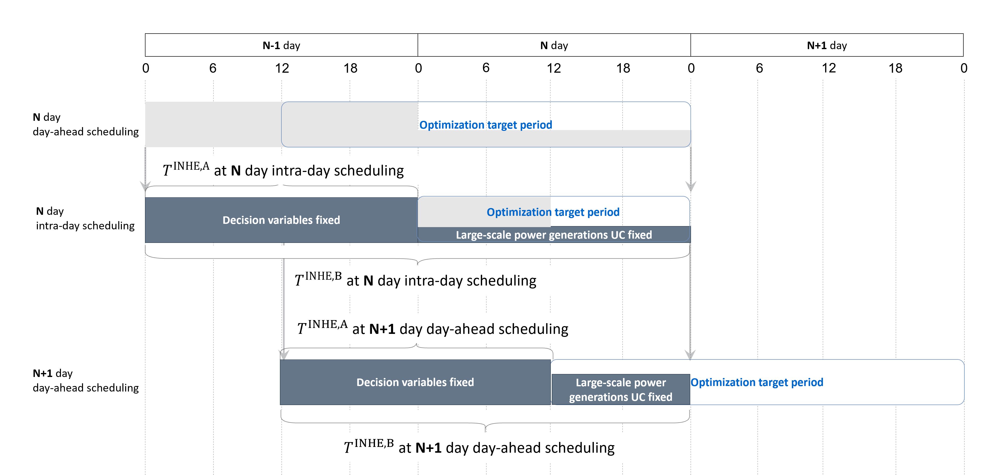

# Constraints on rolling optimization

> **Conditional branching by [`formulation_type`](../../06_config/03_unit_commitment.md#formulation_type)**
> The items on this page related to ΔkW (day-ahead scheduling) / kWh (intra-day scheduling) are effective only in the ΔkW-value version (`formulation_type: "delta-kW-bid"`). In `delta-kW-no-market` (default), the tertiary reserve is treated as a single reserve quantity, and these items are disabled.

Rolling optimization is achieved by taking over some of the variables determined in the previous optimization to the pre-optimization target time period. The variables to be taken over are as follows.

- Generation of large-scale power generations $p_{t,g}$
- Variables related to nuclear and thermal power start-up and shutdown plans $u_{t,g}$, $su_{t,g}$, $sd_{t,g}$
- Energy storage capacity of energy storage systems $e_{t,ess}$

- Each variable has a different target period to inherit.
  - Inheritance period for variables $p_{t,g}$ and $e_{t,ess}$ $T^{\text{INHE,A}}$
    - Start time: Start time of the period for which the variable is prepared before the next period to be optimized.
    - End time: Time before the next optimization period.
  - Inheritance period for variables $u_{t,g}$, $su_{t,g}$, and $sd_{t,g}$ related to nuclear and thermal power start-up and shutdown plans $T^{\text{INHE,B}}$
    - Start time: Start time of the period for which the variable is prepared before the next period to be optimized.
    - End time: Last time of the current optimization period

See the following pages for definitions of each set, index, constant, and variable.

- [Sets and indices](../03_set_and_index.md)
- Parameters
  1. [Parameters for area](../04_parameter/01_area.md)
  2. [Parameters for large-scale power generation](../04_parameter/02_generation.md)
  3. [Parameters for renewable energy](../04_parameter/03_re.md)
  4. [Parameters for energy storage system](../04_parameter/04_ess.md)
  5. [Parameters for tie line](../04_parameter/05_tie.md)
  6. [Parameters that depends on scheduling kind](../04_parameter/06_depend_on_scheduling_kind.md)
- Variables
  1. [Variables for area](../05_variable/01_area.md)
  2. [Variables for large-scale power generation](../05_variable/02_generation.md)
  3. [Variables for renewable energy](../05_variable/03_re.md)
  4. [Variables for energy storage system](../05_variable/04_ess.md)
  5. [Variables for tie line](../05_variable/05_tie.md)

## 1. Inheritance of decision variables from the previous optimization (common to both modes)

The inheritance of the generation, start-up/shutdown plan, and stored energy determined in the previous optimization is applied identically in both `delta-kW-no-market` and `delta-kW-bid`.

$$
\begin{aligned}
   p_{t,g}
    & = P_{t,g}^{\text{INHE}}
    & \forall t \in T^{\text{INHE,A}}, \forall g \in G
    & \qquad (2\text{-}6\text{-}1\text{-}1)
\\
   u_{t,g}
    & = U_{t,g}^{\text{INHE}}
    & \forall t \in T^{\text{INHE,B}}, \forall g \in G_{N\\&T}
    & \qquad (2\text{-}6\text{-}1\text{-}2)
\\
   su_{t,g}
    & = SU_{t,g}^{\text{INHE}}
    & \forall t \in T^{\text{INHE,B}}, \forall g \in G_{N\\&T}
    & \qquad (2\text{-}6\text{-}1\text{-}3)
\\
   sd_{t,g}
    & = SD_{t,g}^{\text{INHE}}
    & \forall t \in T^{\text{INHE,B}}, \forall g \in G_{N\\&T}
    & \qquad (2\text{-}6\text{-}1\text{-}4)
\\
   e_{t,ess}
    & = E_{t,ess}^{\text{INHE}}
    & \forall t \in T^{\text{INHE,A}}, \forall ess \in \textit{ESS}
    & \qquad (2\text{-}6\text{-}1\text{-}5)
\end{aligned}
$$

## 2. Inheritance of day-ahead scheduling values in intra-day scheduling (`delta-kW-bid` only)

This section is used only for intra-day scheduling (`intra-day`) of the ΔkW-value version (`formulation_type: "delta-kW-bid"`). Since `delta-kW-no-market` (default) has no distinction between day-ahead / intra-day scheduling and no mechanism for ΔkW, kWh, or $P^{\text{da}}$, the inheritance in this section is not applied.

When intra-day scheduling (`intra-day`) is performed, if the previous optimization was day-ahead scheduling (`day-ahead`), the values of generation and charge/discharge determined in day-ahead scheduling are inherited for use in the constraints of intra-day scheduling.

### Power output of large-scale power generation

The power output $P_{t,g}^{\text{da}}$ of large-scale power generation determined in day-ahead scheduling is inherited over the entire optimization target period $T$ of intra-day scheduling.

$$
\begin{aligned}
   P_{t,g}^{\text{da}}
    & = p_{t,g}^{\text{prev}}
    & \forall t \in T, \forall g \in G
\end{aligned}
$$

Here, $p_{t,g}^{\text{prev}}$ is the power output determined in the previous day-ahead scheduling.

**Notes:**

- When day-ahead scheduling is performed, $P_{t,g}^{\text{da}}$ is not created.
- Even when intra-day scheduling is performed, if the previous optimization was intra-day scheduling, $P_{t,g}^{\text{da}}$ is not created.
- $P_{t,g}^{\text{da}}$ is created over the entire optimization target period $T$ (not only for the period $T^{\text{INHE,B}} \setminus T^{\text{INHE,A}}$).

### Power output and charging power of energy storage systems

The power output $P_{t,ess}^{\text{da},\text{discharge}}$ and charging power $P_{t,ess}^{\text{da},\text{charge}}$ of ESS determined in day-ahead scheduling are inherited over the entire optimization target period $T$ of intra-day scheduling.

$$
\begin{aligned}
   P_{t,ess}^{\text{da},\text{discharge}}
    & = p_{t,ess}^{\text{discharge},\text{prev}}
    & \forall t \in T, \forall ess \in ESS
\\
   P_{t,ess}^{\text{da},\text{charge}}
    & = p_{t,ess}^{\text{charge},\text{prev}}
    & \forall t \in T, \forall ess \in ESS
\end{aligned}
$$

Here, $p_{t,ess}^{\text{discharge},\text{prev}}$ and $p_{t,ess}^{\text{charge},\text{prev}}$ are the power output and charging power of ESS determined in the previous day-ahead scheduling.

**Notes:**

- When day-ahead scheduling is performed, $P_{t,ess}^{\text{da},\text{discharge}}$ and $P_{t,ess}^{\text{da},\text{charge}}$ are not created.
- Even when intra-day scheduling is performed, if the previous optimization was intra-day scheduling, $P_{t,ess}^{\text{da},\text{discharge}}$ and $P_{t,ess}^{\text{da},\text{charge}}$ are not created.
- $P_{t,ess}^{\text{da},\text{discharge}}$ and $P_{t,ess}^{\text{da},\text{charge}}$ are created over the entire optimization target period $T$.

These values are used in the constraints for the average power output and charge/discharge in intra-day scheduling ([Constraints on large-scale power generation](../02_constraint/02_generation.md#average-power-output-in-intra-day-scheduling-delta-kw-bid-only), [Constraints on energy storage systems (ESS)](../02_constraint/04_ess.md#average-power-output-and-charging-power-in-intra-day-scheduling-delta-kw-bid-only)).

### Tertiary reserve of large-scale power generation

The tertiary reserve $P_{t,g}^{\text{da},\Delta\text{kW}\,\text{Tert}\,\text{UP}}$ and $P_{t,g}^{\text{da},\Delta\text{kW}\,\text{Tert}\,\text{DOWN}}$ of large-scale power generation determined in day-ahead scheduling are inherited over the entire optimization target period $T$ of intra-day scheduling.

$$
\begin{aligned}
   P_{t,g}^{\text{da},\Delta\text{kW}\,\text{Tert}\,\text{UP}}
    & = p_{t,g}^{\Delta\text{kW}\,\text{Tert}\,\text{UP},\text{prev}}
    & \forall t \in T, \forall g \in G
\\
   P_{t,g}^{\text{da},\Delta\text{kW}\,\text{Tert}\,\text{DOWN}}
    & = p_{t,g}^{\Delta\text{kW}\,\text{Tert}\,\text{DOWN},\text{prev}}
    & \forall t \in T, \forall g \in G
\end{aligned}
$$

Here, $p_{t,g}^{\Delta\text{kW}\,\text{Tert}\,\text{UP},\text{prev}}$ and $p_{t,g}^{\Delta\text{kW}\,\text{Tert}\,\text{DOWN},\text{prev}}$ are the tertiary reserve determined in the previous day-ahead scheduling.

**Notes:**

- When day-ahead scheduling is performed, $P_{t,g}^{\text{da},\Delta\text{kW}\,\text{Tert}\,\text{UP}}$ and $P_{t,g}^{\text{da},\Delta\text{kW}\,\text{Tert}\,\text{DOWN}}$ are not created.
- Even when intra-day scheduling is performed, if the previous optimization was intra-day scheduling, $P_{t,g}^{\text{da},\Delta\text{kW}\,\text{Tert}\,\text{UP}}$ and $P_{t,g}^{\text{da},\Delta\text{kW}\,\text{Tert}\,\text{DOWN}}$ are not created.
- $P_{t,g}^{\text{da},\Delta\text{kW}\,\text{Tert}\,\text{UP}}$ and $P_{t,g}^{\text{da},\Delta\text{kW}\,\text{Tert}\,\text{DOWN}}$ are created over the entire optimization target period $T$.

### Tertiary reserve of energy storage systems

The tertiary reserve $P_{t,ess}^{\text{da},\Delta\text{kW}\,\text{Tert}\,\text{UP}}$ and $P_{t,ess}^{\text{da},\Delta\text{kW}\,\text{Tert}\,\text{DOWN}}$ of ESS determined in day-ahead scheduling are inherited over the entire optimization target period $T$ of intra-day scheduling.

$$
\begin{aligned}
   P_{t,ess}^{\text{da},\Delta\text{kW}\,\text{Tert}\,\text{UP}}
    & = p_{t,ess}^{\Delta\text{kW}\,\text{Tert}\,\text{UP},\text{prev}}
    & \forall t \in T, \forall ess \in ESS
\\
   P_{t,ess}^{\text{da},\Delta\text{kW}\,\text{Tert}\,\text{DOWN}}
    & = p_{t,ess}^{\Delta\text{kW}\,\text{Tert}\,\text{DOWN},\text{prev}}
    & \forall t \in T, \forall ess \in ESS
\end{aligned}
$$

Here, $p_{t,ess}^{\Delta\text{kW}\,\text{Tert}\,\text{UP},\text{prev}}$ and $p_{t,ess}^{\Delta\text{kW}\,\text{Tert}\,\text{DOWN},\text{prev}}$ are the tertiary reserve of ESS determined in the previous day-ahead scheduling.

**Notes:**

- When day-ahead scheduling is performed, $P_{t,ess}^{\text{da},\Delta\text{kW}\,\text{Tert}\,\text{UP}}$ and $P_{t,ess}^{\text{da},\Delta\text{kW}\,\text{Tert}\,\text{DOWN}}$ are not created.
- Even when intra-day scheduling is performed, if the previous optimization was intra-day scheduling, $P_{t,ess}^{\text{da},\Delta\text{kW}\,\text{Tert}\,\text{UP}}$ and $P_{t,ess}^{\text{da},\Delta\text{kW}\,\text{Tert}\,\text{DOWN}}$ are not created.
- $P_{t,ess}^{\text{da},\Delta\text{kW}\,\text{Tert}\,\text{UP}}$ and $P_{t,ess}^{\text{da},\Delta\text{kW}\,\text{Tert}\,\text{DOWN}}$ are created over the entire optimization target period $T$.

These values are used in the constraints for tertiary reserve in intra-day scheduling.
